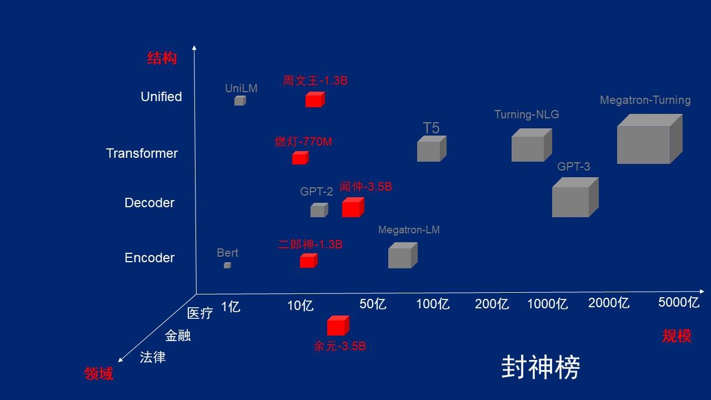

# Fengshenbang-LM
封神榜-LM是IDEA认知计算中心主导的基础大模型开源计划,我们计划从模型结构、模型尺寸、专业领域三个维度去开发基础大模型，并逐步开源我们最新的研究成果。
预训练大模型是认知智能和自然语言的基础设施。不同的模型结构，不同的模型尺寸，再加上不同的专业领域，预训练大模型构成了一个巨大的空间。大模型训练需要昂贵的算力和高技术人才，训练一个适用于各自领域任务的大模型对小团队和小公司来说是巨大的挑战。在这个空间中，目前只填充了为数不多的模型，这些模型中，又只有少数是开源的。

为了全方面建设中文自然语言的基础设施，沈向洋院士在IDEA研究院宣布，我们开启一个“封神榜”大模型开源计划。
* 我们将覆盖不同的模型结构、不同的模型尺寸、不同的专业领域，全谱系的开放多个大模型系列。
* 我们也会持续的对这些模型进行升级，持续在模型规模、知识融入、监督任务辅助等方向不断优化，保持最新的训练数据和最新的训练算法，让这些大模型始终居于领先地位。
* 我们也希望各个公司、高校、机构跟我们合作，一起共建大模型开源体系。
* 希望我们的一起努力，可以推动中文认知智能和自然语言的深入发展和产业落地。


  
## 二郎神系列

Encoder结构为主的双向语言模型，专注于解决各种自然语言理解任务。
13亿参数的二郎神-1.3B大模型，采用280G数据，32张A100训练14天，是最大的开源中文Bert大模型。2021年11月10日在中文语言理解权威评测基准FewCLUE 榜单上登顶。其中，CHID(成语填空)、TNEWS(新闻分类)超过人类，CHID(成语填空)、CSLDCP(学科文献分类)、OCNLI(自然语言推理)单任务第一，刷新小样本学习记录。二郎神系列会持续在模型规模、知识融入、监督任务辅助等方向不断优化。


### 模型下载地址
[二郎神-1.3B](https://big-models.obs.cn-north-4.myhuaweicloud.com:443/%E4%BA%8C%E9%83%8E%E7%A5%9E-1.3B.zip?AccessKeyId=UFREDVP4MG5MSSDPRU0V&Expires=1668225215&Signature=aCDiVHK6xIiLnrLTWLa2ysKRcRY%3D)

### 模型加载
``` python
from transformers import MegatronBertConfig, MegatronBertModel
from transformers import BertTokenizer

model_pretrained_weight_path='/home/'  #模型的权重路径
tokenizer = BertTokenizer.from_pretrained(model_pretrained_weight_path)
config=MegatronBertConfig.from_pretrained(model_pretrained_weight_path)
model=MegatronBertModel.from_pretrained(model_pretrained_weight_path)

```
### 使用示例
为了便于开发者快速使用我们的开源模型，这里提供了一个下游任务的finetune示例脚本，使用的[CLUE](https://github.com/CLUEbenchmark/CLUE)上的afqmc语义匹配任务数据，运行脚本如下。其中data_path为数据路径，afqmc任务数据的[下载地址](https://github.com/CLUEbenchmark/CLUE)，pretrained_model_path为预训练模型的路径。
``` sh
python example/finetune.py " \
        --train_data_path $TRAIN_DATA_PATH \
        --dev_data_path $DEV_DATA_PATH \
        --test_data_path $TSET_DATA_PATH \
        --pretrained_model_path $PRETRAINED_MODEL_PATH \
        --checkpoints ./model.pth \
        --output_path ./afqmc_predict.json \
        --log_file_path ./finetune.log \
        --batch_size 32 \
        --learning_rate 0.00002 \
        --max_length 64 \
        --epoch 7 \
        --model_type megatron \
            "
```
为了便于开发者在开源模型的基础上继续做任务相关的预训练，这里提供了一个继续预训练的pretraining脚本，运行脚本如下：
``` sh
python example/pretraining.py " \
        --train_data_path $TRAIN_DATA_PATH \
        --dev_data_path $DEV_DATA_PATH \
        --test_data_path $TSET_DATA_PATH \
        --pretrained_model_path $PRETRAINED_MODEL_PATH \
        --checkpoints ./model.pth \
        --output_path ./afqmc_predict.json \
        --log_file_path ./pretraining.log \
        --batch_size 128 \
        --learning_rate 0.00002 \
        --max_length 64 \
        --epoch 135 \
        --model_type megatron \
            "
```


### 下游效果
|     模型   | afqmc    |  tnews  | iflytek    |  ocnli  |  cmnli  | wsc  | csl  |
| :--------:    | :-----:  | :----:  | :-----:   | :----: | :----: | :----: | :----: |
| roberta-wwm-ext-large | 0.7514      |   0.5872    | 0.6152      |   0.777    | 0.814    | 0.8914    | 0.86    |
| 二郎神-1.3B | 0.7608      |   0.5996    | 0.6234      |   0.7917    | 0.81    | 0.9243    | 0.872    |

## 周文王系列

IDEA研究院认知计算中心联合追一科技有限公司的新结构大模型。该模型在训练阶段就统一考虑LM（Language Model）和MLM（Mask Language Model）任务，增加了旋转位置编码技术，让模型同时具备生成和理解的能力。目前已有13亿参数的周文王-1.3B大模型，是中文领域同时做LM和MLM任务最大的模型，会持续在模型规模、知识融入、监督任务辅助等方向不断优化。


### 模型下载地址

[周文王-1.3B](https://big-models.obs.cn-north-4.myhuaweicloud.com:443/%E5%91%A8%E6%96%87%E7%8E%8B-1.3B.zip?AccessKeyId=UFREDVP4MG5MSSDPRU0V&Expires=1668225200&Signature=5azS%2BtqThr0MiFtWULwM2tE/Tug%3D)<br>
[周文王-110M](https://big-models.obs.cn-north-4.myhuaweicloud.com:443/%E5%91%A8%E6%96%87%E7%8E%8B-110M.zip?AccessKeyId=UFREDVP4MG5MSSDPRU0V&Expires=1668249599&Signature=e32GpUhDTbyVrnrFW022WJNTDDQ%3D)
### 模型加载
由于HuggingFace没有现成的双任务RoFormer模型结构。因此需要从本仓库model文件夹中提供的脚本导入。导入示例如下：

``` python
from model.roformer.modeling_roformer import RoFormerModel            #从本仓库提供的roformer文件中导入roformer模型
from model.roformer.configuration_roformer import RoFormerConfig
from transformers import BertTokenizer

model_pretrained_weight_path='./home/'  #预训练模型权重路径
tokenizer = BertTokenizer.from_pretrained(model_pretrained_weight_path)
config = model = RoFormerConfig.from_pretrained(model_pretrained_weight_path)
model = RoFormerModel.from_pretrained(model_pretrained_weight_path)
```


### 使用示例

``` sh
python example/finetune.py " \
        --train_data_path $TRAIN_DATA_PATH \
        --dev_data_path $DEV_DATA_PATH \
        --test_data_path $TSET_DATA_PATH \
        --pretrained_model_path $PRETRAINED_MODEL_PATH \
        --checkpoints ./model.pth \
        --output_path ./afqmc_predict.json \
        --log_file_path ./finetune.log \
        --batch_size 32 \
        --learning_rate 0.00002 \
        --max_length 64 \
        --epoch 7 \
        --model_type roformer \
            "
```

### 下游效果

#### 自然语言理解
使用周文王-1.3B模型进行自然语言理解任务时，需要将token_type全部设置为0。周文王的下游任务表现如下：

|     模型   | afqmc    |  tnews  | iflytek    |  ocnli  |  cmnli  | wsc  | csl  |
| :--------:    | :-----:  | :----:  | :-----:   | :----: | :----: | :----: | :----: |
| roberta-wwm-ext-large | 0.7514      |   0.5872    | 0.6152      |   0.777    | 0.814    | 0.8914    | 0.86    |
| 周文王-1.3B | 0.7463     |   0.6036    | 0.6288     |   0.7654   | 0.7741    | 0.8849    | 0. 8777   |

#### 自然语言生成
使用周文王-1.3B模型进行自然语言生成任务时，需要将token_type全部设置为1。周文王的生成例子如下：

```
 input:清华大学位于
 output:清华大学位于北京市海淀区，是中国著名的学府，也是全球最受欢迎的大学之一。

 input:深圳是
 output: 深圳是国家经济、金融、科技的龙头，创造繁荣的城市。

 ```


## 闻仲系列
Decoder结构为主的单向语言模型，是一系列强大的生成模型。
35亿参数的闻仲-3.5B大模型，采用100G数据，256张A100训练28小时。

### 使用示例
``` python
import torch
from transformers import GPT2Tokenizer, GPT2LMHeadModel
model_pretrained_weight_path='/home/'  #模型的权重路径
tokenizer = GPT2Tokenizer.from_pretrained(model_pretrained_weight_path)
model = GPT2LMHeadModel.from_pretrained(model_pretrained_weight_path)
device = torch.device("cuda:6")
model.to(device)
model.eval()
model.half()
text = "北京是中国的首都"
encoded_input = torch.tensor([tokenizer.encode(text)]).to(device)
output = model.generate(input_ids=encoded_input, max_length=32, num_return_sequences=1)
for sentence in output:
    sentence = sentence.tolist()
    text = tokenizer.decode(sentence, clean_up_tokenization_spaces=True)
    print(text)

```

### 模型下载地址
[闻仲-3.5B](https://big-models.obs.cn-north-4.myhuaweicloud.com:443/%E9%97%BB%E4%BB%B2-3.5B.zip?AccessKeyId=UFREDVP4MG5MSSDPRU0V&Expires=1668225244&Signature=1HSpdcstUw2DMuiOufYRRN8fPio%3D)


## 燃灯
Transformer结构为主的编解码语言模型，7.7亿参数的燃灯-7.7B大模型，采用280G数据，16张A100训练14天。

## 余元
医学领域的余元系列，35亿参数余元-3.5B大模型，采用50G的医疗领域数据和知识，在已有的通用模型基础上继续训练，256张A100训练28小时，应用于医学领域的生成和判定任务。


### 模型下载地址
[余元-3.5B](https://big-models.obs.cn-north-4.myhuaweicloud.com:443/%E4%BD%99%E5%85%83-3.5B.zip?AccessKeyId=UFREDVP4MG5MSSDPRU0V&Expires=1668225231&Signature=C8Ai5VAyd4/ZPPWnIjEXi0wP1U8%3D)

## FAQ

## License

[Apache License 2.0](LICENSE)
