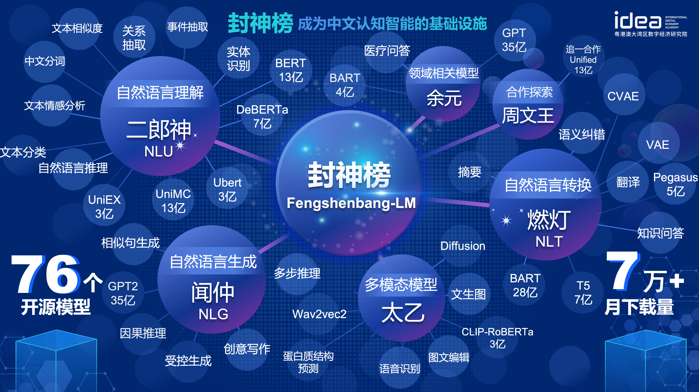
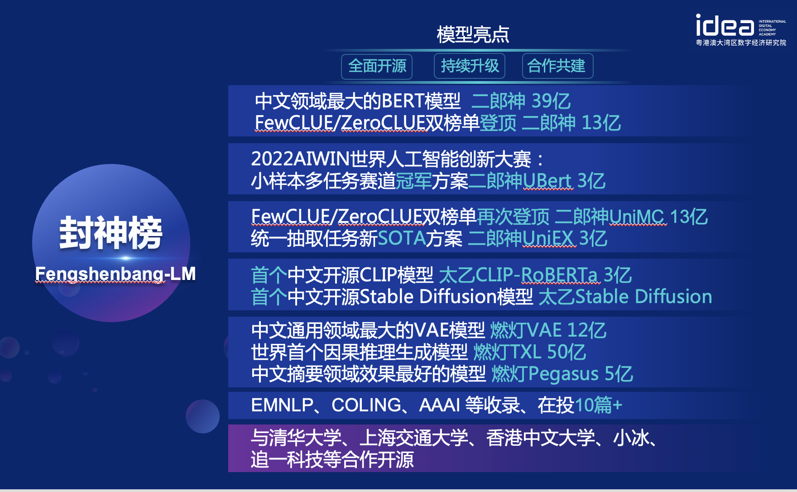

[**中文**](./README.md) | [**English**](./README_en.md)

# 封神榜大事件
- [Finetune一下，“封神榜”预训练语言模型“二郎神”获SimCLUE榜一](https://mp.weixin.qq.com/s/KXQtCgxZlCnv0HqSyQAteQ) 2022.07.14
- [封神框架正式开源，帮你轻松预训练和微调“封神榜”各大模型](https://mp.weixin.qq.com/s/NtaEVMdTxzTJfVr-uQ419Q) 2022.06.30
- [GTS模型生产平台开放公测，用AI自动化生产AI模型](https://mp.weixin.qq.com/s/AFp22hzElkBmJD_VHW0njQ) 2022.05.23
- [数据集发布！IDEA研究院CCNL×NLPCC 2022 任务挑战赛开始了，优胜队伍将获IDEA实习机会](https://mp.weixin.qq.com/s/AikMy6ygfnRagOw3iWuArA) 2022.04.07
- [又刷新了！IDEA CCNL预训练语言模型“二郎神”，这次拿下了ZeroCLUE](https://mp.weixin.qq.com/s/Ukp0JOUwAZJiegdX_4ox2Q) 2022.01.24
- [IDEA Friends | CCNL Team“封神榜”，他们为什么选择IDEA？](https://mp.weixin.qq.com/s/eCmMtopG9DGvZ0qWM3C6Sg) 2022.01.12
- [IDEA大会发布｜“封神榜”大模型开源计划](https://mp.weixin.qq.com/s/Ct06-vLEKoYMyJQPBV2n0w) 2021.11.25
- [IDEA研究院中文预训练模型二郎神登顶FewCLUE榜单](https://mp.weixin.qq.com/s/bA_9n_TlBE9P-UzCn7mKoA) 2021.11.11

# 导航

- [导航](#导航)
- [模型系列简介](#模型系列简介)
- [Fengshenbang-LM](#fengshenbang-lm)
  - [二郎神系列](#二郎神系列)
    - [模型下载地址](#模型下载地址)
    - [模型加载](#模型加载)
    - [使用示例](#使用示例)
    - [下游效果](#下游效果)
- [封神框架](#封神框架)
- [封神榜系列文章](#封神榜系列文章)
- [引用](#引用)
- [联系我们](#联系我们)
- [版权许可](#版权许可)

# 模型系列简介
|系列名称|参数规模|结构|领域|适用任务|备注|
|-|-|-|-|-|-|
|[二郎神](https://fengshenbang-doc.readthedocs.io/zh/latest/docs/%E4%BA%8C%E9%83%8E%E7%A5%9E%E7%B3%BB%E5%88%97/index.html)|1亿-13亿参数|Encoder结构为主的双向语言模型|通用|语言理解|最大的开源中文bert模型，FewCLUE/ZeroCLUE均达到SOTA|
|[闻仲](https://fengshenbang-doc.readthedocs.io/zh/latest/docs/%E9%97%BB%E4%BB%B2%E7%B3%BB%E5%88%97/index.html)|1亿-35亿参数|Decoder结构为主的单向语言模型|通用|语言生成||
|[燃灯](https://fengshenbang-doc.readthedocs.io/zh/latest/docs/%E7%87%83%E7%81%AF%E7%B3%BB%E5%88%97/index.html)|7千万-7亿参数|T5/BART编解码结构为主|通用|语言理解+语言生成||
|[余元](https://fengshenbang-doc.readthedocs.io/zh/latest/docs/%E4%BD%99%E5%85%83%E7%B3%BB%E5%88%97/index.html)|1亿-35亿参数|多种结构|医疗|语言生成|目前最大的开源GPT2医疗模型|
|[比干](https://fengshenbang-doc.readthedocs.io/zh/latest/docs/%E6%AF%94%E5%B9%B2%E7%B3%BB%E5%88%97/index.html)|11亿参数|Transformer-XL结构|通用|语义纠错||
|[周文王](https://fengshenbang-doc.readthedocs.io/zh/latest/docs/%E5%91%A8%E6%96%87%E7%8E%8B%E7%B3%BB%E5%88%97/index.html)|1亿-13亿参数|单双向统一语言模型|通用|语言理解+语言生成|基于roformer结构修改，最大的同时进行LM+MLM的模型|
|[太乙](https://fengshenbang-doc.readthedocs.io/zh/latest/docs/%E5%A4%AA%E4%B9%99%E7%B3%BB%E5%88%97/index.html)|8千万-1亿参数|双流结构|多模态|多模态语义理解||

[封神榜模型下载链接](https://huggingface.co/IDEA-CCNL)

[封神榜模型训练和微调代码脚本](https://github.com/IDEA-CCNL/Fengshenbang-LM/tree/main/fengshen/examples)

[封神榜模型训练手册](https://fengshenbang-doc.readthedocs.io/zh/latest/index.html)

# Fengshenbang-LM
最近两年，预训练逐渐成为整个认知智能的基础，自然语言和计算机视觉的算法全方面的依赖于预训练模型来构建。

预训练模型的规模从最初的1亿参数BERT到一千多亿参数的GTP-3，正在以每年10倍的速度增加。针对不同的下游任务，需要不同的结构，不同的尺寸和不同的专业领域的预训练模型。
这个世界需要更多更大的模型。但是，有限的算力资源是限制整个领域进一步发展的瓶颈。尤其是高校、小公司和一些传统公司，根本不具备足够的算力来训练和使用大规模预训练模型。这些都阻碍了整个人工智能技术更进一步的落地。

这个世界需要一个答案。

IDEA研究院正式宣布，开启 “封神榜”大模型开源计划。“封神榜”将全方面的开源一系列NLP相关的预训练大模型，它们将覆盖文本分类、文本续写、文本摘要、语义纠错等NLP相关任务，不同的专业领域。而且我们承诺，将对这些模型做持续的升级，不断融合最新的数据和最新的训练算法。通过IDEA研究院的努力，打造中文认知智能的通用基础设施，避免重复建设，为全社会节省算力。



同时，“封神榜”也希望各个公司、高校、机构加入到这个开源计划中，一起共建大模型开源体系。未来，当我们需要一个新的预训练模型，都应该是首先从这些开源大模型中选取一个最接近的，做继续训练，然后再把新的模型开源回这个体系。这样，每个人用最少的算力，就能得到自己的模型，同时这个开源大模型体系也能越来越大。



为了更好的体验，拥抱开源社区，封神榜的所有模型都转化并同步到了Huggingface社区，你可以通过几行代码就能轻松使用封神榜的所有模型，欢迎来[IDEA-CCNL的huggingface社区](https://huggingface.co/IDEA-CCNL)下载。

## 二郎神系列

Encoder结构为主的双向语言模型，专注于解决各种自然语言理解任务。
13亿参数的二郎神-1.3B大模型，采用280G数据，32张A100训练14天，是最大的开源中文Bert大模型。2021年11月10日在中文语言理解权威评测基准FewCLUE 榜单上登顶。其中，CHID(成语填空)、TNEWS(新闻分类)超过人类，CHID(成语填空)、CSLDCP(学科文献分类)、OCNLI(自然语言推理)单任务第一，刷新小样本学习记录。二郎神系列会持续在模型规模、知识融入、监督任务辅助等方向不断优化。


2022年1月24日，二郎神-MRC在中文语言理解评测零样本ZeroCLUE榜单上登顶。其中，CSLDCP(学科文献分类)、TNEWS(新闻分类)，IFLYTEK(应用描述分类)、CSL(摘要关键字识别)、CLUEWSC(指代消解)单任务均为第一。


### 模型下载地址
[Huggingface 二郎神-1.3B](https://huggingface.co/IDEA-CCNL/Erlangshen-MegatronBert-1.3B)

### 模型加载
``` python
from transformers import MegatronBertConfig, MegatronBertModel
from transformers import BertTokenizer

tokenizer = BertTokenizer.from_pretrained("IDEA-CCNL/Erlangshen-MegatronBert-1.3B")
config = MegatronBertConfig.from_pretrained("IDEA-CCNL/Erlangshen-MegatronBert-1.3B")
model = MegatronBertModel.from_pretrained("IDEA-CCNL/Erlangshen-MegatronBert-1.3B")
```

### 使用示例
为了便于开发者快速使用我们的开源模型，这里提供了一个下游任务的[finetune示例脚本](https://github.com/IDEA-CCNL/Fengshenbang-LM/blob/main/fengshen/scripts/finetune_classification.sh)，使用的[CLUE](https://github.com/CLUEbenchmark/CLUE)上的tnews新闻分类任务数据，运行脚本如下。其中DATA_PATH为数据路径，tnews任务数据的[下载地址](https://github.com/CLUEbenchmark/CLUE).

1、首先修改finetune示例脚本[fengshen/scripts/finetune_classification.sh](https://github.com/IDEA-CCNL/Fengshenbang-LM/blob/main/fengshen/scripts/finetune_classification.sh)中的model_type和pretrained_model_path参数。其他如batch_size、data_dir等参数可根据自己的设备修改。
``` sh
MODEL_TYPE=huggingface-megatron_bert
PRETRAINED_MODEL_PATH=IDEA-CCNL/Erlangshen-MegatronBert-1.3B
```
2、然后运行：
``` sh
sh finetune_classification.sh
```

### 下游效果
|     模型   | afqmc    |  tnews  | iflytek    |  ocnli  |  cmnli  | wsc  | csl  |
| :--------:    | :-----:  | :----:  | :-----:   | :----: | :----: | :----: | :----: |
| roberta-wwm-ext-large | 0.7514      |   0.5872    | 0.6152      |   0.777    | 0.814    | 0.8914    | 0.86    |
| Erlangshen-MegatronBert-1.3B | 0.7608      |   0.5996    | 0.6234      |   0.7917    | 0.81    | 0.9243    | 0.872    |


# 封神框架
为了让大家好用封神榜大模型，参与大模型的继续训练和下游应用，我们同步开源了FengShen(封神)框架。我们参考了[HuggingFace](https://github.com/huggingface/transformers), [Megatron-LM](https://github.com/NVIDIA/Megatron-LM), [Pytorch-Lightning](https://github.com/PyTorchLightning/pytorch-lightning), [DeepSpeed](https://github.com/microsoft/DeepSpeed)等优秀的开源框架，结合NLP领域的特点, 以Pytorch为基础框架，Pytorch-Lightning为Pipeline重新设计了FengShen。 FengShen可以应用在基于海量数据(TB级别数据)的大模型(百亿级别参数)预训练以及各种下游任务的微调，用户可以通过配置的方式很方便地进行分布式训练和节省显存的技术，更加聚焦在模型实现和创新。同时FengShen也能直接使用[HuggingFace](https://github.com/huggingface/transformers)中的模型结构进行继续训练，方便用户进行领域模型迁移。FengShen针对封神榜开源的模型和模型的应用，提供丰富、真实的源代码和示例。随着封神榜模型的训练和应用，我们也会不断优化FengShen框架，敬请期待。

[三分钟上手封神](fengshen/README.md)


# 封神榜系列文章
[封神榜系列之从数据并行开始大模型训练](https://zhuanlan.zhihu.com/p/512194216)

[封神榜系列之是时候给你的训练提提速了](https://zhuanlan.zhihu.com/p/485369778)

[封神榜系列之中文pegasus模型预训练](https://zhuanlan.zhihu.com/p/528716336)

[封神榜系列：finetune一下二郎神就不小心拿下了第一](https://zhuanlan.zhihu.com/p/539870077)

[封神榜系列之快速搭建你的算法demo](https://zhuanlan.zhihu.com/p/528077249)

[2022AIWIN世界人工智能创新大赛：小样本多任务赛道冠军方案](https://zhuanlan.zhihu.com/p/539958182)


# 引用
```
@misc{Fengshenbang-LM,
  title={Fengshenbang-LM},
  author={IDEA-CCNL},
  year={2021},
  howpublished={\url{https://github.com/IDEA-CCNL/Fengshenbang-LM}},
}
```
# 联系我们
IDEA研究院CCNL技术团队已创建封神榜开源讨论群，我们将在讨论群中不定期更新发布封神榜新模型与系列文章。请扫描下面二维码或者微信搜索“wxid_2qjw79580xsh22”，添加封神空间小助手进群交流！


我们也在持续招人，欢迎投递简历！


# 版权许可 

[Apache License 2.0](LICENSE)
