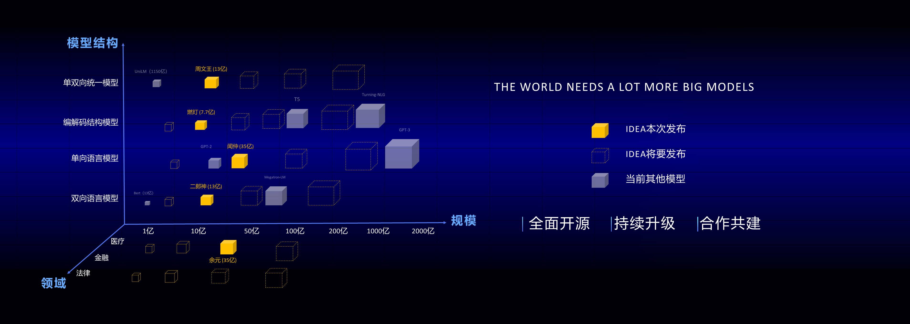
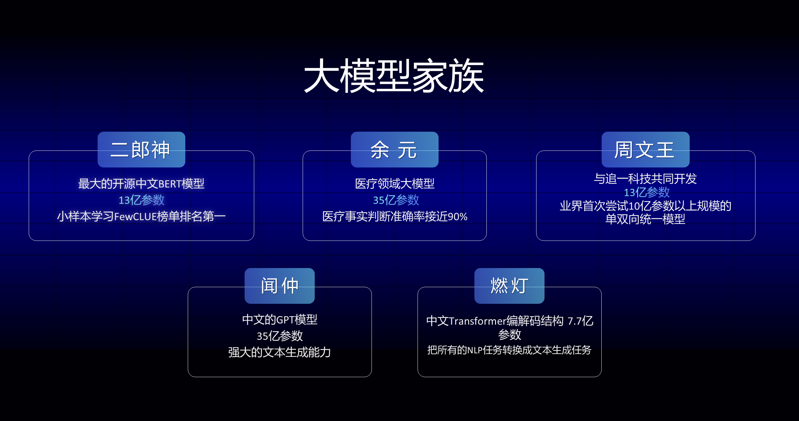

[**中文**](./README.md) | [**English**](./README_en.md)

# 导航
* [模型简介](#模型简介)
* [Fengshenbang-LM](#Fengshenbang-LM)
  + [二郎神系列](#二郎神系列)
  + [周文王系列](#周文王系列)
  + [闻仲系列](#闻仲系列)
  + [燃灯系列](#燃灯系列)
  + [余元系列](#余元系列)
* [引用](#引用)
* [联系我们](#联系我们)
* [版权许可](#版权许可)

# 模型简介
|模型|规模|结构|领域|适用任务|备注|
|-|-|-|-|-|-|
|二郎神|13亿参数（Erlangshen-1.3B）|Encoder结构为主的双向语言模型|通用|语言理解|最大的开源中文bert模型，小样本学习榜单FewCLUE达到sota|
|周文王|13亿参数（Zhouwenwang-1.3B）|单双向统一语言模型|通用|语言理解+语言生成|基于roformer结构修改，最大的同时进行LM+MLM的模型|
|闻仲|35亿参数（Wenzhong-3.5B）|Decoder结构为主的单向语言模型|通用|语言生成||
|燃灯|7.7亿参数（Randeng-770M）|编码解码模型，transformer/T5结构为主|通用|语言理解+语言生成||
|余元|35亿参数（Yuyuan-3.5B）|GPT-2结构的单向语言模型|医疗|语言生成|目前最大的开源GPT2医疗模型|

# Fengshenbang-LM
最近两年，预训练逐渐成为整个认知智能的基础，自然语言和计算机视觉的算法全方面的依赖于预训练模型来构建。

预训练模型的规模从最初的1亿参数BERT到一千多亿参数的GTP-3，正在以每年10倍的速度增加。针对不同的下游任务，我们需要不同的结构，不同的尺寸和不同的专业领域的预训练模型。
这个世界需要更多更大的模型。但是，有限的算力资源是限制整个领域进一步发展的瓶颈。尤其是高校、小公司和一些传统公司，根本不具备足够的算力来训练和使用大规模预训练模型。这些都阻碍了整个人工智能技术更进一步的落地。

这个世界需要一个答案。

IDEA研究院正式宣布，我们开启 “封神榜”大模型开源计划。在这个计划中，我们全方面的开源一系列的自然语言预训练大模型，它们将覆盖不同的模型结构、不同的模型尺寸、不同的专业领域。而且我们承诺，我们将对这些模型做持续的升级，不断融合最新的数据和最新的训练算法。通过我们IDEA研究院的努力，我们打造中文认知智能的通用基础设施，避免重复建设，我们为全社会节省算力。



同时，我们也希望各个公司、高校、机构加入到这个开源计划中，一起共建大模型开源体系。未来，当我们需要一个新的预训练模型，都应该是首先从这些开源大模型中选取一个最接近的，做继续训练，然后再把新的模型开源回这个体系。这样，每个人用最少的算力，就能得到自己的模型，同时这个开源大模型体系也能越来越大。



为了更好的体验，拥抱开源社区，封神榜的所有模型都转化并同步到了Huggingface社区，你可以通过几行代码就能轻松使用封神榜的所有模型，欢迎来[IDEA-CCNL的huggingface社区](https://huggingface.co/IDEA-CCNL)下载。


# 安装Fengshen

``` sh
git clone https://github.com/IDEA-CCNL/Fengshenbang-LM.git
cd Fengshenbang-LM
python setup.py install
```

## 二郎神系列

Encoder结构为主的双向语言模型，专注于解决各种自然语言理解任务。
13亿参数的二郎神-1.3B大模型，采用280G数据，32张A100训练14天，是最大的开源中文Bert大模型。2021年11月10日在中文语言理解权威评测基准FewCLUE 榜单上登顶。其中，CHID(成语填空)、TNEWS(新闻分类)超过人类，CHID(成语填空)、CSLDCP(学科文献分类)、OCNLI(自然语言推理)单任务第一，刷新小样本学习记录。二郎神系列会持续在模型规模、知识融入、监督任务辅助等方向不断优化。


2022年1月24日，二郎神-MRC在中文语言理解评测零样本ZeroCLUE榜单上登顶。其中，CSLDCP(学科文献分类)、TNEWS(新闻分类)，IFLYTEK(应用描述分类)、CSL(摘要关键字识别)、CLUEWSC(指代消解)单任务均为第一。


### 模型下载地址
[Huggingface 二郎神-1.3B](https://huggingface.co/IDEA-CCNL/Erlangshen-1.3B)

### 模型加载
``` python
from transformers import MegatronBertConfig, MegatronBertModel
from transformers import BertTokenizer

tokenizer = BertTokenizer.from_pretrained("IDEA-CCNL/Erlangshen-1.3B")
config = MegatronBertConfig.from_pretrained("IDEA-CCNL/Erlangshen-1.3B")
model = MegatronBertModel.from_pretrained("IDEA-CCNL/Erlangshen-1.3B")

```
### 使用示例
为了便于开发者快速使用我们的开源模型，这里提供了一个下游任务的[finetune示例脚本](https://github.com/IDEA-CCNL/Fengshenbang-LM/blob/main/fengshen/scripts/finetune_classification.sh)，使用的[CLUE](https://github.com/CLUEbenchmark/CLUE)上的tnews新闻分类任务数据，运行脚本如下。其中DATA_PATH为数据路径，tnews任务数据的[下载地址](https://github.com/CLUEbenchmark/CLUE).
#### 使用步骤如下：
1、首先修改finetune示例脚本[fengshen/scripts/finetune_classification.sh](https://github.com/IDEA-CCNL/Fengshenbang-LM/blob/main/fengshen/scripts/finetune_classification.sh)中的model_type和pretrained_model_path参数。其他如batch_size、data_dir等参数可根据自己的设备修改。
``` sh
MODEL_TYPE=huggingface-megatron_bert
PRETRAINED_MODEL_PATH=IDEA-CCNL/Erlangshen-1.3B
```
2、然后运行：
``` sh
sh finetune_classification.sh
```

### 下游效果
|     模型   | afqmc    |  tnews  | iflytek    |  ocnli  |  cmnli  | wsc  | csl  |
| :--------:    | :-----:  | :----:  | :-----:   | :----: | :----: | :----: | :----: |
| roberta-wwm-ext-large | 0.7514      |   0.5872    | 0.6152      |   0.777    | 0.814    | 0.8914    | 0.86    |
| 二郎神-1.3B | 0.7608      |   0.5996    | 0.6234      |   0.7917    | 0.81    | 0.9243    | 0.872    |

## 周文王系列

IDEA研究院认知计算中心联合追一科技有限公司的新结构大模型。该模型在训练阶段就统一考虑LM（Language Model）和MLM（Mask Language Model）任务，增加了旋转位置编码技术，让模型同时具备生成和理解的能力。目前已有13亿参数的周文王-1.3B大模型，是中文领域同时做LM和MLM任务最大的模型，会持续在模型规模、知识融入、监督任务辅助等方向不断优化。


### 模型下载地址

[Huggingface 周文王-1.3B](https://huggingface.co/IDEA-CCNL/Zhouwenwang-1.3B)<br>
[Huggingface 周文王-110M](https://huggingface.co/IDEA-CCNL/Zhouwenwang-110M)
### 模型加载
由于我们现在的周文王结构是在追一科技之前的roformer结构进行的修改，而HuggingFace还没有周文王的模型结构。因此需要从本仓库的fengshen框架导入。导入之后，即可按照下面的脚本从huggingface下载并加载对应的模型：

``` python
from fengshen import RoFormerConfig
from fengshen import RoFormerModel
from transformers import BertTokenizer 

tokenizer = BertTokenizer.from_pretrained('IDEA-CCNL/Zhouwenwang-110M')
config = RoFormerConfig.from_pretrained('IDEA-CCNL/Zhouwenwang-110M')
model = RoFormerModel.from_pretrained('IDEA-CCNL/Zhouwenwang-110M')
```


### 使用示例
1、首先修改finetune示例脚本[fengshen/scripts/finetune_classification.sh](https://github.com/IDEA-CCNL/Fengshenbang-LM/blob/main/fengshen/scripts/finetune_classification.sh)中的model_type和pretrained_model_path参数。其他如batch_size、data_dir等参数可根据自己的设备修改。
``` sh
MODEL_TYPE=fengshen-roformer
PRETRAINED_MODEL_PATH=IDEA-CCNL/Zhouwenwang-110M
```
2、然后运行：
``` sh
sh finetune_classification.sh
```

### 下游效果

#### 自然语言理解
使用周文王-1.3B模型进行自然语言理解任务时，需要将token_type全部设置为0。周文王的下游任务表现如下：

|     模型   | afqmc    |  tnews  | iflytek    |  ocnli  |  cmnli  | wsc  | csl  |
| :--------:    | :-----:  | :----:  | :-----:   | :----: | :----: | :----: | :----: |
| roberta-wwm-ext-large | 0.7514      |   0.5872    | 0.6152      |   0.777    | 0.814    | 0.8914    | 0.86    |
| 周文王-1.3B | 0.7463     |   0.6036    | 0.6288     |   0.7654   | 0.7741    | 0.8849    | 0. 8777   |

#### 自然语言生成
使用周文王-1.3B模型进行自然语言生成任务时，需要将token_type全部设置为1。周文王的生成例子如下：

```python
from fengshen import RoFormerModel
from transformers import BertTokenizer 
import torch
import numpy as np

sentence = '清华大学位于'
max_length = 32

tokenizer = BertTokenizer.from_pretrained('IDEA-CCNL/Zhouwenwang-110M')
model = RoFormerModel.from_pretrained('IDEA-CCNL/Zhouwenwang-110M')

for i in range(max_length):
    encode = [tokenizer.cls_token_id]+tokenizer.encode(sentence, add_special_tokens=False)
    input_ids=torch.tensor([encode]).long()
    token_type_ids=torch.tensor([[1]*len(encode)]).long()
    logits = model(input_ids=input_ids, 
                   token_type_ids=token_type_ids)[0]
    logits = torch.nn.functional.linear(
        logits, model.embeddings.word_embeddings.weight)
    logits = torch.nn.functional.softmax(
        logits, dim=-1).cpu().detach().numpy()[0]
    sentence = sentence + \
        tokenizer.decode(int(np.random.choice(logits.shape[1], p=logits[-1])))
    if sentence[-1] == '。':
        break
print(sentence)

 ```


## 闻仲系列
Decoder结构为主的单向语言模型，是一系列强大的生成模型。
35亿参数的闻仲-3.5B大模型，采用100G数据，256张A100训练28小时。

### 模型下载地址
[Huggingface 闻仲-3.5B](https://huggingface.co/IDEA-CCNL/Wenzhong-3.5B)

### load model
```python 
from transformers import GPT2Tokenizer, GPT2Model
tokenizer = GPT2Tokenizer.from_pretrained('IDEA-CCNL/Wenzhong-3.5B')
model = GPT2Model.from_pretrained('IDEA-CCNL/Wenzhong-3.5B')
text = "Replace me by any text you'd like."
encoded_input = tokenizer(text, return_tensors='pt')
output = model(**encoded_input)
```
### generation
```python
from transformers import pipeline, set_seed
set_seed(55)
generator = pipeline('text-generation', model='IDEA-CCNL/Wenzhong-3.5B')
generator("北京是中国的", max_length=30, num_return_sequences=1)

```


## 燃灯系列
Transformer结构为主的编解码语言模型，7.7亿参数的燃灯-770M大模型，采用280G数据，16张A100训练14天。

### 模型下载地址
[Huggingface 燃灯-770M](https://huggingface.co/IDEA-CCNL/Randeng-770M/)

### 模型加载
由于T5结构的燃灯-770M模型是基于Megatron进行训练的，而Megatron的T5模型结构与HuggingFace的T5模型结构有略微的区别，不能直接使用HuggingFace的T5模型进行导入。因此需要从本仓库fengshen框架导入。导入之后，即可按照下面的脚本从huggingface下载并加载对应的模型：

``` python
from fengshen import T5Config
from fengshen import T5EncoderModel
from fengshen import T5Tokenizer

tokenizer = T5Tokenizer.from_pretrained('IDEA-CCNL/Randeng-770M')
config = T5Config.from_pretrained('IDEA-CCNL/Randeng-770M')
model = T5EncoderModel.from_pretrained('IDEA-CCNL/Randeng-770M')
```

### 使用示例
1、首先修改finetune示例脚本[fengshen/scripts/finetune_classification.sh](https://github.com/IDEA-CCNL/Fengshenbang-LM/blob/main/fengshen/scripts/finetune_classification.sh)中的model_type和pretrained_model_path参数。其他如batch_size、data_dir等参数可根据自己的设备修改。
``` sh
MODEL_TYPE=fengshen-megatron_t5
PRETRAINED_MODEL_PATH=IDEA-CCNL/Randeng-770M
```
2、然后运行：
``` sh
sh finetune_classification.sh
```

#### 生成任务使用示例

```python
from fengshen import T5ForConditionalGeneration
from fengshen import T5Tokenizer

tokenizer = T5Tokenizer.from_pretrained('IDEA-CCNL/Randeng-770M')
model = T5ForConditionalGeneration.from_pretrained('IDEA-CCNL/Randeng-770M')

output = model.generate(tokenizer.encode(tokenizer.encode('北京是中国的<extra_id_0>')))
print(tokenizer.decode(output))

```


## 余元系列
医学领域的余元系列，35亿参数余元-3.5B大模型，采用50G的医疗领域数据和知识，在已有的通用模型基础上继续训练，32张A100训练7天，是目前最大的开源GPT2医疗大模型。我们的模型在医学领域的事实判断中具有近90%的准确率。

我们利用余元-3.5B大模型实现事实判断，医学问答。更多的可能性等着你去发现。


### 模型下载地址
[Huggingface 余元-3.5B](https://huggingface.co/IDEA-CCNL/Yuyuan-3.5B)

### load model
```python 
from transformers import GPT2Tokenizer, GPT2Model
tokenizer = GPT2Tokenizer.from_pretrained('IDEA-CCNL/Yuyuan-3.5B')
model = GPT2Model.from_pretrained('IDEA-CCNL/Yuyuan-3.5B')
text = "Replace me by any text you'd like."
encoded_input = tokenizer(text, return_tensors='pt')
output = model(**encoded_input)
```
### generation
```python
from transformers import pipeline, set_seed
set_seed(55)
generator = pipeline('text-generation', model='IDEA-CCNL/Yuyuan-3.5B')
generator("Diabetics should not eat", max_length=30, num_return_sequences=1)

```

# 引用
```
@misc{Fengshenbang-LM,
  title={Fengshenbang-LM},
  author={IDEA-CCNL},
  year={2021},
  howpublished={\url{https://github.com/IDEA-CCNL/Fengshenbang-LM}},
}
```
# 联系我们


# 版权许可 

[Apache License 2.0](LICENSE)
