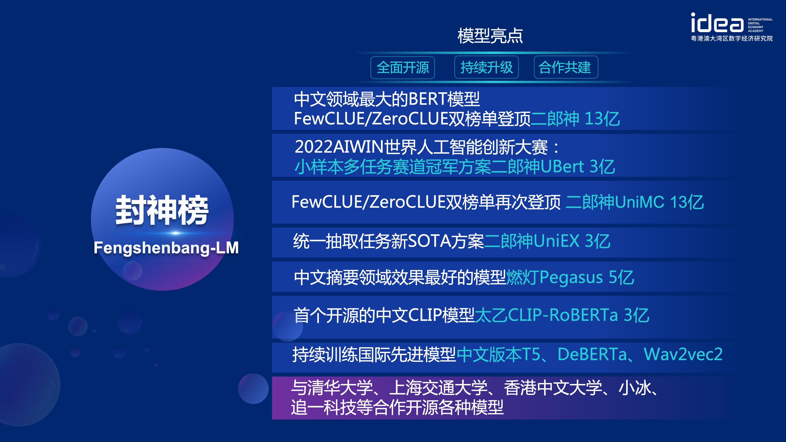

[**中文**](./README.md) | [**English**](./README_en.md)

# 封神榜大事件

- [AIWIN大赛冠军，封神榜提出多任务学习方案Ubert](https://mp.weixin.qq.com/s/A9G0YLbIPShKgm98DnD2jA) 2022.07.21
- [Finetune一下，“封神榜”预训练语言模型“二郎神”获SimCLUE榜一](https://mp.weixin.qq.com/s/KXQtCgxZlCnv0HqSyQAteQ) 2022.07.14
- [封神框架正式开源，帮你轻松预训练和微调“封神榜”各大模型](https://mp.weixin.qq.com/s/NtaEVMdTxzTJfVr-uQ419Q) 2022.06.30
- [GTS模型生产平台开放公测，用AI自动化生产AI模型](https://mp.weixin.qq.com/s/AFp22hzElkBmJD_VHW0njQ) 2022.05.23
- [数据集发布！IDEA研究院CCNL×NLPCC 2022 任务挑战赛开始了，优胜队伍将获IDEA实习机会](https://mp.weixin.qq.com/s/AikMy6ygfnRagOw3iWuArA) 2022.04.07
- [又刷新了！IDEA CCNL预训练语言模型“二郎神”，这次拿下了ZeroCLUE](https://mp.weixin.qq.com/s/Ukp0JOUwAZJiegdX_4ox2Q) 2022.01.24
- [IDEA Friends | CCNL Team“封神榜”，他们为什么选择IDEA？](https://mp.weixin.qq.com/s/eCmMtopG9DGvZ0qWM3C6Sg) 2022.01.12
- [IDEA大会发布｜“封神榜”大模型开源计划](https://mp.weixin.qq.com/s/Ct06-vLEKoYMyJQPBV2n0w) 2021.11.25
- [IDEA研究院中文预训练模型二郎神登顶FewCLUE榜单](https://mp.weixin.qq.com/s/bA_9n_TlBE9P-UzCn7mKoA) 2021.11.11

# 导航

- [封神榜大事件](#封神榜大事件)
- [导航](#导航)
- [模型系列简介](#模型系列简介)
- [Fengshenbang-LM](#fengshenbang-lm)
- [封神榜模型](#封神榜模型)
  - [二郎神系列](#二郎神系列)
    - [模型下载地址](#模型下载地址)
    - [模型加载](#模型加载)
    - [使用示例](#使用示例)
    - [下游效果](#下游效果)
- [封神框架](#封神框架)
  - [安装](#安装)
    - [使用自己的环境安装](#使用自己的环境安装)
    - [使用Docker](#使用docker)
  - [Pipelines](#pipelines)
- [封神榜单](#封神榜单)
- [封神榜系列文章](#封神榜系列文章)
- [引用](#引用)
- [联系我们](#联系我们)
- [版权许可](#版权许可)

# 模型系列简介

|系列名称|需求|适用任务|参数规模|备注|
|:---:|:---:|:---:|:---:|---|
|[二郎神](https://fengshenbang-doc.readthedocs.io/zh/latest/docs/%E4%BA%8C%E9%83%8E%E7%A5%9E%E7%B3%BB%E5%88%97/index.html)|通用|语言理解|9千万-39亿参数|处理理解任务，拥有开源时最大的中文bert模型，2021登顶<br>FewCLUE和ZeroCLUE|
|[闻仲](https://fengshenbang-doc.readthedocs.io/zh/latest/docs/%E9%97%BB%E4%BB%B2%E7%B3%BB%E5%88%97/index.html)|通用|语言生成|1亿-35亿参数|专注于生成任务，提供了多个不同参数量的生成模型，例如<br>GPT2等|
|[燃灯](https://fengshenbang-doc.readthedocs.io/zh/latest/docs/%E7%87%83%E7%81%AF%E7%B3%BB%E5%88%97/index.html)|通用|语言转换|7千万-7亿参数|处理各种从源文本转换到目标文本类型的任务，例如机器<br>翻译，文本摘要等|  
|[太乙](https://fengshenbang-doc.readthedocs.io/zh/latest/docs/%E5%A4%AA%E4%B9%99%E7%B3%BB%E5%88%97/index.html)|特定|多模态|8千万-1亿参数|应用于跨模态场景，包括文本图像生成，蛋白质结构预测, <br>语音-文本表示等|
|[余元](https://fengshenbang-doc.readthedocs.io/zh/latest/docs/%E4%BD%99%E5%85%83%E7%B3%BB%E5%88%97/index.html)|特定|领域|1亿-35亿参数|应用于领域，如医疗，金融，法律，编程等。拥有目前最大<br>的开源GPT2医疗模型|
|-待定-|特定|探索|-未知-|我们希望与各技术公司和大学一起开发NLP相关的实验模型。<br>目前已有：[周文王](https://fengshenbang-doc.readthedocs.io/zh/latest/docs/%E5%91%A8%E6%96%87%E7%8E%8B%E7%B3%BB%E5%88%97/index.html)|

[封神榜模型下载链接](https://huggingface.co/IDEA-CCNL)

[封神榜模型训练和微调代码脚本](https://github.com/IDEA-CCNL/Fengshenbang-LM/tree/main/fengshen/examples)

[封神榜模型训练手册](https://fengshenbang-doc.readthedocs.io/zh/latest/index.html)

# Fengshenbang-LM

人工智能的显著进步产生了许多伟大的模型，特别是基于预训练的基础模型成为了一种新兴的范式。传统的AI模型必须要在专门的巨大的数据集上为一个或几个有限的场景进行训练，相比之下，基础模型可以适应广泛的下游任务。基础模型造就了AI在低资源的场景下落地的可能。  
我们观察到这些模型的参数量正在以每年10倍的速度增长。2018年的BERT，在参数量仅有1亿量级，但是到了2020年，GPT-3的参数量就已达到百亿的量级。由于这一鼓舞人心的趋势，人工智能中的许多前沿挑战，尤其是强大的泛化能力，逐渐变得可以被实现。

如今的基础模型，尤其是语言模型，正在被英文社区主导着。与此同时，中文作为这个世界上最大的口语语种（母语者中），却缺乏系统性的研究资源支撑，这使得中文领域的研究进展相较于英文来说有些滞后。

这个世界需要一个答案。

为了解决中文领域研究进展滞后和研究资源严重不足的问题，IDEA研究院正式宣布，开启 “封神榜”开源体系——一个以中文驱动的基础生态系统，其中包括了预训练大模型，特定任务的微调应用，基准和数据集等。我们的目标是构建一个全面的，标准化的，以用户为中心的生态系统。尽管这一目标可以通过多种方式去实现，但是我们经过对中文社区的重新审视与思考，提出了我们认为最为有效的方案：


尽管这看起来可能有些复杂，但是只需三步，用户就可以根据我们的资源轻松构建所需的应用了。
- 步骤1: 从我们的封神榜模型库中选择一个预训练好的中文NLP模型.
- 步骤2: 通过阅读我们的教程示例，使用封神框架调整模型。
- 步骤3: 在我们的封神榜单或者自定义任务中评估模型在下游任务上的表现。

# 封神榜模型

“封神榜模型”将全方面的开源一系列NLP相关的预训练大模型。NLP社区中有着广泛的研究任务，这些任务可以被分为两类：通用任务和特殊任务。前者包括了自然语言理解(NLU)，自然语言生成(NLG)和自然语言转换(NLT)任务。后者涵盖了多模态，特定领域等任务。我们考虑了所有的这些任务，并且提供了在下游任务上微调好的相关模型，这使得计算资源有限的用户也可以轻松使用我们的基础模型。而且我们承诺，将对这些模型做持续的升级，不断融合最新的数据和最新的训练算法。通过IDEA研究院的努力，打造中文认知智能的通用基础设施，避免重复建设，为全社会节省算力。


同时，“封神榜”也希望各个公司、高校、机构加入到这个开源计划中，一起共建大模型开源体系。未来，当我们需要一个新的预训练模型，都应该是首先从这些开源大模型中选取一个最接近的，做继续训练，然后再把新的模型开源回这个体系。这样，每个人用最少的算力，就能得到自己的模型，同时这个开源大模型体系也能越来越大。



为了更好的体验，拥抱开源社区，封神榜的所有模型都转化并同步到了Huggingface社区，你可以通过几行代码就能轻松使用封神榜的所有模型，欢迎来[IDEA-CCNL的huggingface社区](https://huggingface.co/IDEA-CCNL)下载。

## 二郎神系列

Encoder结构为主的双向语言模型，专注于解决各种自然语言理解任务。
13亿参数的二郎神-1.3B大模型，采用280G数据，32张A100训练14天，是最大的开源中文Bert大模型。2021年11月10日在中文语言理解权威评测基准FewCLUE 榜单上登顶。其中，CHID(成语填空)、TNEWS(新闻分类)超过人类，CHID(成语填空)、CSLDCP(学科文献分类)、OCNLI(自然语言推理)单任务第一，刷新小样本学习记录。二郎神系列会持续在模型规模、知识融入、监督任务辅助等方向不断优化。


2022年1月24日，二郎神-MRC在中文语言理解评测零样本ZeroCLUE榜单上登顶。其中，CSLDCP(学科文献分类)、TNEWS(新闻分类)，IFLYTEK(应用描述分类)、CSL(摘要关键字识别)、CLUEWSC(指代消解)单任务均为第一。


### 模型下载地址

[Huggingface 二郎神-1.3B](https://huggingface.co/IDEA-CCNL/Erlangshen-MegatronBert-1.3B)

### 模型加载

``` python
from transformers import MegatronBertConfig, MegatronBertModel
from transformers import BertTokenizer

tokenizer = BertTokenizer.from_pretrained("IDEA-CCNL/Erlangshen-MegatronBert-1.3B")
config = MegatronBertConfig.from_pretrained("IDEA-CCNL/Erlangshen-MegatronBert-1.3B")
model = MegatronBertModel.from_pretrained("IDEA-CCNL/Erlangshen-MegatronBert-1.3B")
```

### 使用示例

为了便于开发者快速使用我们的开源模型，这里提供了一个下游任务的[finetune示例脚本](https://github.com/IDEA-CCNL/Fengshenbang-LM/blob/main/fengshen/examples/classification/finetune_classification.sh)，使用的[CLUE](https://github.com/CLUEbenchmark/CLUE)上的tnews新闻分类任务数据，运行脚本如下。其中DATA_PATH为数据路径，tnews任务数据的[下载地址](https://github.com/CLUEbenchmark/CLUE).

1、首先修改finetune示例脚本[finetune_classification.sh](https://github.com/IDEA-CCNL/Fengshenbang-LM/blob/main/fengshen/examples/classification/finetune_classification.sh)中的model_type和pretrained_model_path参数。其他如batch_size、data_dir等参数可根据自己的设备修改。

``` sh
MODEL_TYPE=huggingface-megatron_bert
PRETRAINED_MODEL_PATH=IDEA-CCNL/Erlangshen-MegatronBert-1.3B
```

2、然后运行：

``` sh
sh finetune_classification.sh
```

### 下游效果

|     模型   | afqmc    |  tnews  | iflytek    |  ocnli  |  cmnli  | wsc  | csl  |
| :--------:    | :-----:  | :----:  | :-----:   | :----: | :----: | :----: | :----: |
| roberta-wwm-ext-large | 0.7514      |   0.5872    | 0.6152      |   0.777    | 0.814    | 0.8914    | 0.86    |
| Erlangshen-MegatronBert-1.3B | 0.7608      |   0.5996    | 0.6234      |   0.7917    | 0.81    | 0.9243    | 0.872    |

# 封神框架

为了让大家用好封神榜大模型，参与大模型的继续训练和下游应用，我们同步开源了以用户为中心的FengShen(封神)框架。详情请见：[FengShen(封神)框架](https://github.com/IDEA-CCNL/Fengshenbang-LM/tree/main/fengshen)。

我们参考了[HuggingFace](https://github.com/huggingface/transformers), [Megatron-LM](https://github.com/NVIDIA/Megatron-LM), [Pytorch-Lightning](https://github.com/PyTorchLightning/pytorch-lightning), [DeepSpeed](https://github.com/microsoft/DeepSpeed)等优秀的开源框架，结合NLP领域的特点, 以Pytorch为基础框架，Pytorch-Lightning为Pipeline重新设计了FengShen。 FengShen可以应用在基于海量数据(TB级别数据)的大模型(百亿级别参数)预训练以及各种下游任务的微调，用户可以通过配置的方式很方便地进行分布式训练和节省显存的技术，更加聚焦在模型实现和创新。同时FengShen也能直接使用[HuggingFace](https://github.com/huggingface/transformers)中的模型结构进行继续训练，方便用户进行领域模型迁移。FengShen针对封神榜开源的模型和模型的应用，提供丰富、真实的源代码和示例。随着封神榜模型的训练和应用，我们也会不断优化FengShen框架，敬请期待。

## 安装

### 使用自己的环境安装

```shell
git clone https://github.com/IDEA-CCNL/Fengshenbang-LM.git
cd Fengshenbang-LM
git submodule init
git submodule update
# submodule是我们用来管理数据集的fs_datasets，通过ssh的方式拉取，如果用户没有在机器上配置ssh-key的话可能会拉取失败。
# 如果拉取失败，需要到.gitmodules文件中把ssh地址改为https地址即可。
pip install --editable .
```

### 使用Docker

我们提供一个简单的包含torch、cuda环境的docker来运行我们的框架。

```shell
sudo docker run --runtime=nvidia --rm -itd --ipc=host --name fengshen fengshenbang/pytorch:1.10-cuda11.1-cudann8-devel
sudo docker exec -it fengshen bash
cd Fengshenbang-LM
# 更新代码 docker内的代码可能不是最新的
git pull
git submodule foreach 'git pull origin master' 
# 即可快速的在docker中使用我们的框架啦
```

## Pipelines

封神框架目前在适配各种下游任务的Pipeline，支持命令行一键启动Predict、Finetuning。
以Text Classification为例

```python
# predict
❯ fengshen-pipeline text_classification predict --model='IDEA-CCNL/Erlangshen-Roberta-110M-Similarity' --text='今天心情不好[SEP]今天很开心'
[{'label': 'not similar', 'score': 0.9988130331039429}]

# train
fengshen-pipeline text_classification train --model='IDEA-CCNL/Erlangshen-Roberta-110M-Similarity' --datasets='IDEA-CCNL/AFQMC' --gpus=0 --texta_name=sentence1 --strategy=ddp
```

[三分钟上手封神](fengshen/README.md)

# 封神榜单

我们提出的生态系统中还包括了一个基准模块——“封神榜单“，它允许用户在我们的平台上进行公平的比较，并且可以让整个中文社区追踪NLP模型最新进展。

为了构建高质量和健壮的基准，我们需要考虑到如何测试模型的方方面面。因此，我们在构建封神榜单时确定了以下要求：
- **广泛认可**：虽然一些现有的数据集不是用中文设计的，但它们多年来在NLP领域中被广泛使用，例如[SuperGLUE](https://super.gluebenchmark.com/)。所以，我们将召集一些专业的中英文的语言专家，精心翻译并校对这些热门的数据集。
- **面向未来**：一些NLP模型已经在多个基准测试中超越了人类的表现。我们认为更重要和紧迫的工作是构建一些具有挑战性的数据集，而不是将现有数据集拟合到100%的准确度。未来的基准需要考虑更广泛的道德, 技术和社会上的挑战。我们的数据集将会尽快发布，以更好地支持中文社区的进一步研究。
- **合作共创**：基准需要反映真实世界的场景。我们希望能够与行业活跃的公司合作收集真实世界的数据并发布。

我们在未来会发布榜单管理系统，希望可以推动更多定制的排行榜系统的发展，敬请期待。

# 封神榜系列文章

[封神榜系列之从数据并行开始大模型训练](https://zhuanlan.zhihu.com/p/512194216)

[封神榜系列之是时候给你的训练提提速了](https://zhuanlan.zhihu.com/p/485369778)

[封神榜系列之中文pegasus模型预训练](https://zhuanlan.zhihu.com/p/528716336)

[封神榜系列：finetune一下二郎神就不小心拿下了第一](https://zhuanlan.zhihu.com/p/539870077)

[封神榜系列之快速搭建你的算法demo](https://zhuanlan.zhihu.com/p/528077249)

[2022AIWIN世界人工智能创新大赛：小样本多任务赛道冠军方案](https://zhuanlan.zhihu.com/p/539958182)

# 引用

```
@misc{Fengshenbang-LM,
  title={Fengshenbang-LM},
  author={IDEA-CCNL},
  year={2021},
  howpublished={\url{https://github.com/IDEA-CCNL/Fengshenbang-LM}},
}
```

# 联系我们

IDEA研究院CCNL技术团队已创建封神榜开源讨论群，我们将在讨论群中不定期更新发布封神榜新模型与系列文章。请扫描下面二维码或者微信搜索“fengshenbang-lm”，添加封神空间小助手进群交流！


我们也在持续招人，欢迎投递简历！


# 版权许可

[Apache License 2.0](LICENSE)
