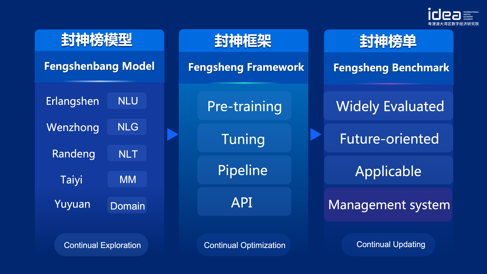

[**中文**](./README.md) | [**English**](./README_en.md)

# Fengshenbang big event

- [AIWIN champion solution, Fengshenbang proposed multi-task learning model Ubert](https://mp.weixin.qq.com/s/A9G0YLbIPShKgm98DnD2jA) 2022.07.21
- [Just a simple Finetune, "Fengshenbang" pre-trained language model "Erlangshen" won the first place in SimCLUE benchmark](https://mp.weixin.qq.com/s/KXQtCgxZlCnv0HqSyQAteQ) 2022.07.14
- [Fengshen Framework is officially open-sourced, helping you easily pre-train and fine-tune major models in "Fengshenbang"](https://mp.weixin.qq.com/s/NtaEVMdTxzTJfVr-uQ419Q) 2022.06.30
- [GTS model production platform is open to public beta, automatically produces AI models using AI](https://mp.weixin.qq.com/s/AFp22hzElkBmJD_VHW0njQ) 2022.05.23
- [Dataset released！IDEA-CCNL × NLPCC 2022 Mission Challenge has begun, and the winning teams will receive IDEA internship opportunities](https://mp.weixin.qq.com/s/AikMy6ygfnRagOw3iWuArA) 2022.04.07
- [A new record! IDEA-CCNL pretrained language model "Erlangshen", this time won ZeroCLUE](https://mp.weixin.qq.com/s/Ukp0JOUwAZJiegdX_4ox2Q) 2022.01.24
- [IDEA Friends | CCNL Team "Fengshenbang", why did they choose IDEA?](https://mp.weixin.qq.com/s/eCmMtopG9DGvZ0qWM3C6Sg) 2022.01.12
- [IDEA Meeting Release｜"Fengshenbang" Open Source Project](https://mp.weixin.qq.com/s/Ct06-vLEKoYMyJQPBV2n0w) 2021.11.25
- [IDEA Chinese pre-trained language model Erlangshen tops the FewCLUE benchmark](https://mp.weixin.qq.com/s/bA_9n_TlBE9P-UzCn7mKoA) 2021.11.11


# Navigation
- [Fengshenbang big event](#fengshenbang-big-event)
- [Navigation](#navigation)
- [Model Infofrmation](#model-infofrmation)
- [Fengshenbang-LM](#fengshenbang-lm)
- [Fengshenbang Model](#fengshenbang-model)
  - [Erlangshen](#erlangshen)
    - [Download the Models](#download-the-models)
    - [Load the Models](#load-the-models)
    - [Example of Usage](#example-of-usage)
    - [Performance on Downstream Tasks](#performance-on-downstream-tasks)
- [Fengshen Framework](#fengshen-framework)
  - [Installation](#installation)
    - [Installing in an existing environment](#installing-in-an-existing-environment)
    - [Using Docker](#using-docker)
  - [Pipelines](#pipelines)
- [Fengshen Benchmark](#fengshen-benchmark)
- [Fegnshenbang Series Articles](#fegnshenbang-series-articles)
- [Citation](#citation)
- [Contact](#contact)
- [License](#license)

# Model Infofrmation
|Series|Demand|Task|Parameter Scale|Extra|
|:---:|:---:|:---:|:---:|---|
|[Erlangshen](https://fengshenbang-doc.readthedocs.io/zh/latest/docs/%E4%BA%8C%E9%83%8E%E7%A5%9E%E7%B3%BB%E5%88%97/index.html)|General|NLU|97M-3.9B|Erlangshen was designed to solve NLU tasks; The largest BERT when publicly released; SOTA on FewCLUE and ZeroCLUE in 2021.|
|[Wenzhong](https://fengshenbang-doc.readthedocs.io/zh/latest/docs/%E9%97%BB%E4%BB%B2%E7%B3%BB%E5%88%97/index.html)|General|NLG|1B-3.5B|Wenzhong focuses on NLG tasks; Provides several generative models with different scales, such as GPT2, etc.|
|[Randeng](https://fengshenbang-doc.readthedocs.io/zh/latest/docs/%E7%87%83%E7%81%AF%E7%B3%BB%E5%88%97/index.html)|General|NLT|770M-0.7B|Randeng handles natural language transformation (NLT) type tasks that convert from source text to target text, such as machine translation, text summarization, etc.|
|[Taiyi](https://fengshenbang-doc.readthedocs.io/zh/latest/docs/%E5%A4%AA%E4%B9%99%E7%B3%BB%E5%88%97/index.html)|Speical|MultiModal|87M-0.1B|Taiyi was applied to cross-modality scenarios, including text image generation, protein structure prediction, speech-text representation, etc.|
|[Yuyuan](https://fengshenbang-doc.readthedocs.io/zh/latest/docs/%E4%BD%99%E5%85%83%E7%B3%BB%E5%88%97/index.html)|Speical|Domain|0.1B-3.5B|Yuyuan was applied to specific domains such as healthcare, finance, law, programming, etc; The largest open-source GPT2 medical model|
|-TBD-|Special|Exploration|-Unknown-|This series hopes to develop experimental models on NLP with various technology companies and universities. Currently there are:[Zhouwenwang](https://fengshenbang-doc.readthedocs.io/zh/latest/docs/%E5%91%A8%E6%96%87%E7%8E%8B%E7%B3%BB%E5%88%97/index.html)|


[Download url of Fengshenbang](https://huggingface.co/IDEA-CCNL)

[Fengshenbang Model training and fine-tuning code script](https://github.com/IDEA-CCNL/Fengshenbang-LM/tree/main/fengshen/examples)

[Handbook of Fengshenbang](https://fengshenbang-doc.readthedocs.io/zh/latest/index.html)


# Fengshenbang-LM
Remarkable advances in Artificial Intelligence (AI) have produced great models, in particular, pre-trained based foundation models become an emerging paradigm. In contrast to traditional AI models that must be trained on vast datasets for one or a few scenarios, foundation models can be adapted to a wide range of downstream tasks, therefore, limiting the amount of resource demanded to acquire an AI venture off the ground. 
Moreover, we observe that these models grow rapidly within a short period, around 10 times each year. For instance, BERT has 100 million parameters and GTP-3 has over 100 billion parameters. Many of the forefront challenges in AI, especially generalization ability, are becoming achievable due to this inspiring trend.

Foundation models, most notably language models, are dominated by the English-language community. 
The Chinese language as the world's largest spoken language (native speakers), however, has no systematic research resources to support it, making the progress in the Chinese language domain lag behind others.

And the world needs an answer for this.

IDEA (International Digital Economy Academy) officially announces the launch of "Fengshenbang" open source project —— a Chinese language driven foundation ecosystem, incorporates pre-trained models, task-specific fine-tune applications, benchmarks, and datasets. Our goal is to build a comprehensive, standardized and user-centered ecosystem. Although this can be instantiated in a variety of ways, we present the following design that we find to be particularly effective:



Although this seems complicated, with only 3 sequential steps, users can build their applications based on our resources.
- Step 1: Choosing a pre-trained Chinese NLP model from our open-source library of Fengshenbang Models.
- Step 2: Employing Fengshen Framework to adjust the model by exploring the our tutorial examples.
- Step 3: Evaluating on downstream tasks, such as Fengshenbang Benchmarks or custom tasks.

# Fengshenbang Model

"Fengshenbang Model" will open-source a series of NLP-related pre-trained models in all aspects. There are a wide range of research tasks in the NLP community, which can be divided into two categories: general demands and special demands. In general demands, there are common NLP tasks, which are classified into Natural Language Understanding (NLU), Natural Language Generation (NLG), and Natural Language Transformation (NLT). 
Due to the fast development, NLP community brings special demands to the entire AI community, which are often assigned to MultiModal (MM), Domains and Exploration. We consider all of these tasks and provide models that are fine tuning for downstream tasks, making our base model easy to use for users with limited computing resources. We consider all of these demands and provide models that are fine-tuned for downstream tasks, making our base model easy to use for users with limited computing resources. Moreover, we guarantee that we will optimize the models continuously with new datasets and latest algorithms. We aim to build universal infrastructure for Chinese cognitive intelligence and prevent duplicative construction, and hence save computing resources for the community.


We also call for businesses, universities and institutions to join us with the project and build the sytem of large-scale open-source models collaboratively. We envision that, in the near future, the first choice when in need of a new pretrained model should be selecting one in closest proximity to the desired scale,architecture and domain from the series, followed by further training. After obtaining a trained new model, we shall add it back to the series of open-source models for future usage. In this way we build the open-source system iteratively and collaboratively while individuals could get desired models using minimal computing resources. 


For better open source experience, all models of the Fengshenbang series are synchronized within the Huggingface community, and can be obtained for use within few lines of code. Welcome to download and use our models from our repo at [IDEA-CCNL at HuggingFace](https://huggingface.co/IDEA-CCNL).

 
## Erlangshen

This series focuses on using bidirectional language models with encoders to solve multiple natural language understanding tasks. 
Erlangshen-MegatronBert-1.3B is the largest Chinese open source model with the structure of Bert. It contains 13 billion parameters, and was trained with 280G datasets on 32 A100 GPUs for 14 days. It achieved the top on the Chinese natural language understanding benchmark FewCLUE on Nov 10th, 2021. Among the tasks of FewCLUE, Erlangshen-1.3 beat human performance on the task of CHID(Chinese idioms cloze test) and TNEWS(News Classification), and achieved SOTA on tasks of CHID, CSLDCP（academic literature classification) and OCNLI(Natural language Inference), refreshing the records of few-shot learning. We will continue to optimize the Erlangshen series with respect to model scale, knowledge fusion, auxiliary supervision tasks, etc. 


Erlangshen-MRC achieved the Chinese language comprehension evaluations benchmark ZeroCLUE on Jan 24th, 2022. Among the tasks of ZeroCLUE, CSLDCP (discipline literature classification), TNEWS (news classification), IFLYTEK (application description classification), CSL (abstract keyword recognition), CLUEWSC (reference resolution) achieved SOTA.


### Download the Models
[Huggingface Erlangshen-MegatronBert-1.3B](https://huggingface.co/IDEA-CCNL/Erlangshen-MegatronBert-1.3B)

### Load the Models 
``` python
from transformers import MegatronBertConfig, MegatronBertModel
from transformers import BertTokenizer

tokenizer = BertTokenizer.from_pretrained("IDEA-CCNL/Erlangshen-MegatronBert-1.3B")
config = MegatronBertConfig.from_pretrained("IDEA-CCNL/Erlangshen-MegatronBert-1.3B")
model = MegatronBertModel.from_pretrained("IDEA-CCNL/Erlangshen-MegatronBert-1.3B")

```
### Example of Usage
For the convenience of developers, we offer an example [script](https://github.com/IDEA-CCNL/Fengshenbang-LM/blob/main/fengshen/examples/classification/finetune_classification.sh) for downstream finetuning. The script uses the tnews dataset from [CLUE](https://github.com/CLUEbenchmark/CLUE). 

1、Fisrt, modify the MODEL_TYPE and PRETRAINING_MODEL_PATH parameters of [finetune script](https://github.com/IDEA-CCNL/Fengshenbang-LM/blob/main/fengshen/examples/classification/finetune_classification.sh), and other parameters can be modified according to your specific device.

``` sh
MODEL_TYPE=huggingface-megatron_bert
PRETRAINED_MODEL_PATH=IDEA-CCNL/Erlangshen-MegatronBert-1.3B
```
2、Then, run

``` sh
sh finetune_classification.sh
```

### Performance on Downstream Tasks 
|     Model   | afqmc    |  tnews  | iflytek    |  ocnli  |  cmnli  | wsc  | csl  |
| :--------:    | :-----:  | :----:  | :-----:   | :----: | :----: | :----: | :----: |
| roberta-wwm-ext-large | 0.7514      |   0.5872    | 0.6152      |   0.777    | 0.814    | 0.8914    | 0.86    |
| Erlangshen-MegatronBert-1.3B | 0.7608      |   0.5996    | 0.6234      |   0.7917    | 0.81    | 0.9243    | 0.872    |


# Fengshen Framework

To make it easy for everyone to use the FengShenbang model, participate in the continuous training and downstream applications of the large-scale model, we We simultaneously open-source the user-centered FengShen framework. For details, please also see: [Fengshen Framework](https://github.com/IDEA-CCNL/Fengshenbang-LM/tree/main/fengshen).

Referring to other excellent open source frameworks (including [HuggingFace](https://github.com/huggingface/transformers), [Megatron-LM](https://github.com/NVIDIA/Megatron-LM), [Pytorch-Lightning](https://github.com/PyTorchLightning/pytorch-lightning), [DeepSpeed](https://github.com/microsoft/DeepSpeed)) and combining the characteristics of NLP field, we redesign FengShen with Pytorch as the base framework and Pytorch-Lightning as the Pipeline. FengShen can be applied to pre-training of large models (tens of billions of parameters) based on massive data (terabytes of data) and fine-tuning on various downstream tasks. Users can easily perform distributed training and memory-saving techniques with configuration, thus focusing more on model implementation and innovation. Also, FengShen can directly use the model structure in [HuggingFace](https://github.com/huggingface/transformers) for continued training, which facilitates domain transfer for users. FengShen provides rich and realistic source code and examples. We will continue to optimize the FengShen framework as the models of Fengshenbang are trained and applied. Stay tuned. 

## Installation

### Installing in an existing environment

```shell
git clone https://github.com/IDEA-CCNL/Fengshenbang-LM.git
cd Fengshenbang-LM
git submodule init
git submodule update
# ubmodule is the fs_datasets we use to manage the datasets, pulled by ssh, which may fail if the user does not have ssh-key configured on the machine.
# If the pull fails, you need to go to the .gitmodules file and change the ssh address to an https address.
pip install --editable .
```

### Using Docker

We provide a simple docker, which contains torch and cuda environment to run our framework.

```shell
sudo docker run --runtime=nvidia --rm -itd --ipc=host --name fengshen fengshenbang/pytorch:1.10-cuda11.1-cudann8-devel
sudo docker exec -it fengshen bash
cd Fengshenbang-LM
# Update the code. The code in docker may not be up to date
git pull
git submodule foreach 'git pull origin master' 
# Now you're ready to use our framework in docker
```

## Pipelines

Fenghen framework is currently adapting various downstream tasks in Pipeline, support Predict, Finetuning by one-click in command line.
Take Text Classification as an example

```python
# predict
❯ fengshen-pipeline text_classification predict --model='IDEA-CCNL/Erlangshen-Roberta-110M-Similarity' --text='今天心情不好[SEP]今天很开心'
[{'label': 'not similar', 'score': 0.9988130331039429}]

# train
fengshen-pipeline text_classification train --model='IDEA-CCNL/Erlangshen-Roberta-110M-Similarity' --datasets='IDEA-CCNL/AFQMC' --gpus=0 --texta_name=sentence1 --strategy=ddp
```

[Get Started with Fengshen in 3 Minutes](fengshen/README.md)

# Fengshen Benchmark
Our "Fengshenbang" ecosystem also includes a benchmark module - "Fengshen Benchmark", which allows users to make fair comparisons on our platform and allows the entire Chinese community to track the latest advances in NLP models.

To collect high-quality and robust benchmarks, we consider different aspects of testing the models. As a result, we identify the following requirements while building the Fengshenbang benchmark:
- **Widely evaluated**: While some existing datasets are not designed in Chinese, they have been used extensively in NLP for years, e.g. SuperGLUE. We will gather some professional English and Chinese linguists to meticulously translate these popular datasets.
- **Future-oriented**: In fact, a few NLP models already surpass human performance on several benchmarks. This declares that AI has reached or even can surpass human cognitive intelligence. One reason we believe is their limited scope of evaluation. A more urgent and necessary work is to construct challenging datasets instead of fitting existing datasets to $100\%$ accuracy. Future benchmarks need to consider broader ethical, technical, and societal challenges. Our datasets will be published soon to better support the research community.
- **Applicable**: Benchmarks are required to represent real-world scenarios. This allows us to collaborate with industry-active companies to publish datasets and collect real-world data.

# Fegnshenbang Series Articles

[Fengshen Series: Getting Started on Training Large Model with Data Parallelism](https://zhuanlan.zhihu.com/p/512194216)

[Fengshen Series: It is Time to Accelerate your Training Process!](https://zhuanlan.zhihu.com/p/485369778)

[Fengshen Series: Chinese PEGASUS Model Pre-training](https://zhuanlan.zhihu.com/p/528716336)

[Fengshen Series: Just a Simple Finetune, Erlangshen Accidentally Took the First Place](https://zhuanlan.zhihu.com/p/539870077)

[Fengshen Series: Quickly Build Your Algorithm Demo](https://zhuanlan.zhihu.com/p/528077249)

[2022 AIWIN World Artificial Intelligence Innovation Competition: Small Sample Multi-Task Track Winner Solution](https://zhuanlan.zhihu.com/p/539958182)

# Citation
If you are using the resource for your work, please cite the our [paper](https://arxiv.org/abs/2209.02970):
```
@article{fengshenbang,
  author    = {Junjie Wang and Yuxiang Zhang and Lin Zhang and Ping Yang and Xinyu Gao and Ziwei Wu and Xiaoqun Dong and Junqing He and Jianheng Zhuo and Qi Yang and Yongfeng Huang and Xiayu Li and Yanghan Wu and Junyu Lu and Xinyu Zhu and Weifeng Chen and Ting Han and Kunhao Pan and Rui Wang and Hao Wang and Xiaojun Wu and Zhongshen Zeng and Chongpei Chen and Ruyi Gan and Jiaxing Zhang},
  title     = {Fengshenbang 1.0: Being the Foundation of Chinese Cognitive Intelligence},
  journal   = {CoRR},
  volume    = {abs/2209.02970},
  year      = {2022}
}
```
You can also cite our [website](https://github.com/IDEA-CCNL/Fengshenbang-LM/):
```
@misc{Fengshenbang-LM,
  title={Fengshenbang-LM},
  author={IDEA-CCNL},
  year={2021},
  howpublished={\url{https://github.com/IDEA-CCNL/Fengshenbang-LM}},
}
```
# Contact

IDEA-CCNL team has created the Fengshebang open source discussion group, we will update and release new models and articles of Fengshenbang in the discussion group from time to time. Please scan the QR code below or search "fengshenbang-lm" on WeChat to add the Fengshen space assistant into the group!


We are also continuously recruiting, so feel free to send in your resume!


# License 

[Apache License 2.0](LICENSE)
