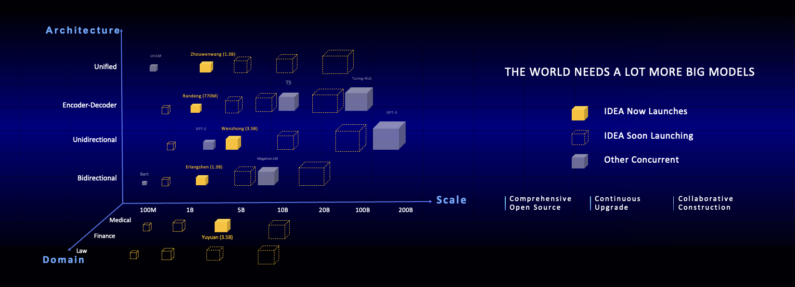

[**中文**](./README.md) | [**English**](./README_en.md)

# Navigation
* [Intro](#Intro)
* [Fengshenbang-LM](#Fengshenbang-LM)
  + [Erlangshen](#Erlangshen)
  + [Zhouwenwang](#Zhouwenwang)
  + [Wenzhong](#Wenzhong)
  + [Randeng](#Randeng)
  + [Yuyuan](#Yuyuan)
* [Citation](#Citation)
* [Contact](#Contact)
* [License](#License)

# Intro
|Model|Scale|Architecture|Domain|Target Tasks|Notes|
|-|-|-|-|-|-|
|Erlangshen|1.3B params（Erlangshen-MegatronBert-1.3B）|Bidirectional Laugnage Models with Encoder structure|Common|NLU|Largest Chinese open source Bert model; SOTA on few-shot learning benchmark FewCLUE|
|Zhouwenwang|1.3B params（Zhouwenwang-Unified-1.3B）|Unified Language Models|Common|NLU+NLG|Modified based on Roformer structure; the largest model trained on both LM and MLM|
|Wenzhong|3.5B params（Wenzhong-GPT2-3.5B）|Unidirectional Language Models with Decoder structure|Common|NLG||
|Randeng|770M params（Randeng-MegatronT5-770M）|Encoder-Decoder structured models with Transformer/T5 structures|Common|NLU+NLG||
|Yuyuan|3.5B params（Yuyuan-GPT2-3.5B）|Unidirectional Language Models with GPT-2 structure|Medical|NLG|Largest open source GPT2 medical model|

# Fengshenbang-LM
Pretraining of large-scale models have gradually become the basis of cognitive computing in recent years; Tasks and algorithms of natural language processing and computer vision heavily rely on pretrained large models.

The scale of pretrained models, measured by the number of parameters, have been growing at a rate of approximately 10 times per year from the initial 110M BERT to the 175B GPT-3. For different downstream tasks, pretrained models that vary in architectures, sizes and expertise domains are needed; in short, the world needs more larger models. 

However, limited computing power is a major bottleneck for the development of the field. Institutions such as most universities, small companies and businesses in traditional areas are not equipped with enough computing resources for training and inferencing with large-scale pretrained models; further industrial practice of artificial intelligence is hence hindered.

And the world needs an answer for this.

IDEA (International Digital Economy Academy) officially announces the launch of "Fengshenbang" open source project. It open sources a series of large-scale natural languguage pretrained models. These models will bring comprehensive coverage across various model architectures, sizes and expertise domains. We guarantee that we will optimize the models continuously with new datasets and latest algorithms. We aim to build universal infrastructure for Chinese cognitive intelligence and prevent duplicative construction, and hence save computing resources for the community.



We also call for businesses, universities and institutions to join us with the project and build the sytem of large-scale open-source models collaboratively. We envision that, in the near future, the first choice when in need of a new pretrained model should be selecting one in closest proximity to the desired scale,architecture and domain from the series, followed by further training. After obtaining a trained new model, we shall add it back to the series of open-source models for future usage. In this way we build the open-source system iteratively and collaboratively while individuals could get desired models using minimal computing resources. 


For better open source experience, all models of the Fengshenbang series are synchronized within the Huggingface community, and can be obtained for use within few lines of code. Welcome to download and use our models from our repo at [IDEA-CCNL at HuggingFace](https://huggingface.co/IDEA-CCNL).

 
## Erlangshen

This series focuses on using bidirectional language models with encoders to solve multiple natural language understanding tasks. 
Erlangshen-MegatronBert-1.3B is the largest Chinese open source model with the structure of Bert. It contains 13 billion parameters, and was trained with 280G datasets on 32 A100 GPUs for 14 days. It achieved the top on the Chinese natural language understanding benchmark FewCLUE on Nov 10th, 2021. Among the tasks of FewCLUE, Erlangshen-1.3 beat human performance on the task of CHID(Chinese idioms cloze test) and TNEWS(News Classification), and achieved SOTA on tasks of CHID, CSLDCP（academic literature classification) and OCNLI(Natural language Inference), refreshing the records of few-shot learning. We will continue to optimize the Erlangshen series with respect to model scale, knowledge fusion, auxiliary supervision tasks, etc. 


Erlangshen-MRC achieved the Chinese language comprehension evaluations benchmark ZeroCLUE on Jan 24th, 2022. Among the tasks of ZeroCLUE, CSLDCP (discipline literature classification), TNEWS (news classification), IFLYTEK (application description classification), CSL (abstract keyword recognition), CLUEWSC (reference resolution) achieved SOTA.


### Download the Models
[Huggingface Erlangshen-MegatronBert-1.3B](https://huggingface.co/IDEA-CCNL/Erlangshen-MegatronBert-1.3B)

### Load the Models 
``` python
from transformers import MegatronBertConfig, MegatronBertModel
from transformers import BertTokenizer

tokenizer = BertTokenizer.from_pretrained("IDEA-CCNL/Erlangshen-MegatronBert-1.3B")
config = MegatronBertConfig.from_pretrained("IDEA-CCNL/Erlangshen-MegatronBert-1.3B")
model = MegatronBertModel.from_pretrained("IDEA-CCNL/Erlangshen-MegatronBert-1.3B")

```
### Example Usage
For the convenience of developers, we offer an example [script](https://github.com/IDEA-CCNL/Fengshenbang-LM/blob/main/fengshen/scripts/finetune_classification.sh) for downstream finetuning. The script uses the tnews dataset from [CLUE](https://github.com/CLUEbenchmark/CLUE). 

#### Steps for usage

1、fisrt,modify the MODEL_TYPE and PRETRAINING_MODEL_PATH parameters of [finetune script](https://github.com/IDEA-CCNL/Fengshenbang-LM/blob/main/fengshen/scripts/finetune_classification.sh), and other parameters can be modified according to your specific equipment.

``` sh
MODEL_TYPE=huggingface-megatron_bert
PRETRAINED_MODEL_PATH=IDEA-CCNL/Erlangshen-MegatronBert-1.3B
```
2、run

``` sh
sh finetune_classification.sh
```


### Downstream Task Performance
|     Model   | afqmc    |  tnews  | iflytek    |  ocnli  |  cmnli  | wsc  | csl  |
| :--------:    | :-----:  | :----:  | :-----:   | :----: | :----: | :----: | :----: |
| roberta-wwm-ext-large | 0.7514      |   0.5872    | 0.6152      |   0.777    | 0.814    | 0.8914    | 0.86    |
| Erlangshen-MegatronBert-1.3B | 0.7608      |   0.5996    | 0.6234      |   0.7917    | 0.81    | 0.9243    | 0.872    |

## Zhouwenwan
This series, with models of newly-designed architectures, is developed collaboratively by IDEA Cognitive Computing Center and Zhuiyi Technology. The models consider LM(Language Model) and MLM(Masked Language Model) jointly from the pretraining stage, and utilize Rotary Position Embedding, therefore the resulting models are capable of both language generation and language understanding. We currently present Zhouwenwang-Unified-1.3B model with 1.3 billion parameters; it is the largest Chinese language model that handles LM and MLM tasks at the same time. We will continue to optimize the Zhouwenwang series with respect to model scale, knowledge fusion, auxiliary supervision tasks, etc. 


### Download The Models

[Huggingface Zhouwenwang-Unified-1.3B](https://huggingface.co/IDEA-CCNL/Zhouwenwang-Unified-1.3B)<br>
[Huggingface Zhouwenwang-Unified-110M](https://huggingface.co/IDEA-CCNL/Zhouwenwang-Unified-110M)
### Load the Models
Currently our Zhouwenwang series of models are modified based on the Roformer structure from Zhuiyi Technology, and we have not added Zhouwenwang series to Huggingface yet. Therefore for now you need to load the fengshen files from this repo to your own working directory, then you can follow the script below to download corresponding models from Huggingface and import them.

``` python
from fengshen import RoFormerModel            #Import Roformer Model from the Roformer Files in this Repo
from fengshen import RoFormerConfig
from transformers import AutoTokenizer

tokenizer = AutoTokenizer.from_pretrained('IDEA-CCNL/Zhouwenwang-Unified-110M')
config = RoFormerConfig.from_pretrained('IDEA-CCNL/Zhouwenwang-Unified-110M')
model = RoFormerModel.from_pretrained('IDEA-CCNL/Zhouwenwang-Unified-110M')
```


### Example Usage

1、fisrt,modify the MODEL_TYPE and PRETRAINING_MODEL_PATH parameters of [finetune script](https://github.com/IDEA-CCNL/Fengshenbang-LM/blob/main/fengshen/scripts/finetune_classification.sh), and other parameters can be modified according to your specific equipment.

``` sh
MODEL_TYPE=fengshen-roformer
PRETRAINED_MODEL_PATH=IDEA-CCNL/Zhouwenwang-Unified-110M
```
2、run

``` sh
sh finetune_classification.sh
```


### Downstream Task Performance

#### Natural Language Understanding
When using Zhouwenwang-Unified-1.3B for NLU tasks, the token_type should be all set to 0. The performance of Zhouwenwang-Unified-1.3B on downstream tasks is as follows:

|    Model   | afqmc    |  tnews  | iflytek    |  ocnli  |  cmnli  | wsc  | csl  |
| :--------:    | :-----:  | :----:  | :-----:   | :----: | :----: | :----: | :----: |
| roberta-wwm-ext-large | 0.7514      |   0.5872    | 0.6152      |   0.777    | 0.814    | 0.8914    | 0.86    |
| Zhouwenwang-Unified-1.3B | 0.7463     |   0.6036    | 0.6288     |   0.7654   | 0.7741    | 0.8849    | 0. 8777   |

#### Natural Language Generation
When using Zhouwenwang-Unified-1.3B for NGL tasks, the token_type should be all set to 1. The performance of Zhouwenwang-Unified-1.3B on downstream tasks is as follows:

```python
from fengshen import RoFormerModel
from transformers import AutoTokenizer
import torch
import numpy as np

sentence = '清华大学位于'
max_length = 32

tokenizer = AutoTokenizer.from_pretrained('IDEA-CCNL/Zhouwenwang-Unified-110M')
model = RoFormerModel.from_pretrained('IDEA-CCNL/Zhouwenwang-Unified-110M')

for i in range(max_length):
    encode = torch.tensor(
        [[tokenizer.cls_token_id]+tokenizer.encode(sentence, add_special_tokens=False)]).long()
    logits = model(encode)[0]
    logits = torch.nn.functional.linear(
        logits, model.embeddings.word_embeddings.weight)
    logits = torch.nn.functional.softmax(
        logits, dim=-1).cpu().detach().numpy()[0]
    sentence = sentence + \
        tokenizer.decode(int(np.random.choice(logits.shape[1], p=logits[-1])))
    if sentence[-1] == '。':
        break
print(sentence)

 ```


## Wenzhong
The Wenzhong Series is a group of powerful generative models that consist of unidirectional lanugage models of decoder structure. 
The Wenzhong-GPT2-3.5B model is trained with 100G datasets on 256 A100 GPUs for 28 hours, and contains 3.5 billion parameters. 

### Download the Models
[Huggingface Wenzhong-GPT2-3.5B](https://huggingface.co/IDEA-CCNL/Wenzhong-GPT2-3.5B)

### Load the Models
```python 
from transformers import GPT2Tokenizer, GPT2Model
tokenizer = GPT2Tokenizer.from_pretrained('IDEA-CCNL/Wenzhong-GPT2-3.5B')
model = GPT2Model.from_pretrained('IDEA-CCNL/Wenzhong-GPT2-3.5B')
text = "Replace me by any text you'd like."
encoded_input = tokenizer(text, return_tensors='pt')
output = model(**encoded_input)
```
### Language Generation
```python
from transformers import pipeline, set_seed
set_seed(55)
generator = pipeline('text-generation', model='IDEA-CCNL/Wenzhong-GPT2-3.5B')
generator("北京是中国的", max_length=30, num_return_sequences=1)

```


## Randeng
The Randong Series is a group of encoding-decoding language models of transformer structure. 
The Randing-770M model is trained with 280G datasets on 16 A100 GPUs for 14 days, and contains 770M parameters. 

### Download the Models
[Huggingface Randeng-MegatronT5-770M](https://huggingface.co/IDEA-CCNL/Randeng-MegatronT5-770M/)

### Load the Models
Our Randeng-MegatronT5-770M is trained based on the T5 structure of Megatron. Since the T5 model structure of Megatron is slightly different from the T5 model structure of Huggingface, directly importing Randeng using HuggingFace T5 is not supported. You need to load the fengshen files from this repo to your own working directory, then you can follow the script below to download corresponding models from Huggingface and import them.

``` python
from fengshen import T5ForConditionalGeneration
from fengshen import T5Config
from fengshen import T5Tokenizer

tokenizer = T5Tokenizer.from_pretrained('IDEA-CCNL/Randeng-MegatronT5-770M')
config = T5Config.from_pretrained('IDEA-CCNL/Randeng-MegatronT5-770M')
model = T5ForConditionalGeneration.from_pretrained('IDEA-CCNL/Randeng-MegatronT5-770M')
```

### Example Usage

1、fisrt,modify the MODEL_TYPE and PRETRAINING_MODEL_PATH parameters of [finetune script](https://github.com/IDEA-CCNL/Fengshenbang-LM/blob/main/fengshen/scripts/finetune_classification.sh), and other parameters can be modified according to your specific equipment.

``` sh
MODEL_TYPE=fengshen-megatron_t5
PRETRAINED_MODEL_PATH=IDEA-CCNL/Randeng-MegatronT5-770M
```
2、run

``` sh
sh finetune_classification.sh
```


#### Example for Generation Task

```python
from fengshen import T5ForConditionalGeneration
from fengshen import T5Tokenizer

tokenizer = T5Tokenizer.from_pretrained('IDEA-CCNL/Randeng-MegatronT5-770M')
model = T5ForConditionalGeneration.from_pretrained('IDEA-CCNL/Randeng-MegatronT5-770M')

output = model.generate(tokenizer.encode(tokenizer.encode('北京是中国的<extra_id_0>')))
print(tokenizer.decode(output))

```


## Yuyuan
The Yuyuan series is a group of models focusing on the medical domain. The Yuyuan-GPT2-3.5B model is trained with 50G medical domain dataset and knowledge based on common domain pretrained models on 32 A100 for 7 days; it is by far the largest open source GPT-2 medical domain language model. It achieves near 90% accuracy in SOP judgement in medical domain. 
We utilize Yuyuan-GPT2-3.5B model for factual judgement and medical Q&A. We are looking forward to more possibilities from you. 


### Download the Models
[Huggingface Yuyuan-GPT2-3.5B](https://huggingface.co/IDEA-CCNL/Yuyuan-GPT2-3.5B)

### Load the Models
```python 
from transformers import GPT2Tokenizer, GPT2Model
tokenizer = GPT2Tokenizer.from_pretrained('IDEA-CCNL/Yuyuan-GPT2-3.5B')
model = GPT2Model.from_pretrained('IDEA-CCNL/Yuyuan-GPT2-3.5B')
text = "Replace me by any text you'd like."
encoded_input = tokenizer(text, return_tensors='pt')
output = model(**encoded_input)
```
### Language Generation
```python
from transformers import pipeline, set_seed
set_seed(55)
generator = pipeline('text-generation', model='IDEA-CCNL/Yuyuan-GPT2-3.5B')
generator("Diabetics should not eat", max_length=30, num_return_sequences=1)

```

# Citation
```
@misc{Fengshenbang-LM,
  title={Fengshenbang-LM},
  author={IDEA-CCNL},
  year={2021},
  howpublished={\url{https://github.com/IDEA-CCNL/Fengshenbang-LM}},
}
```
# Contact


# License

[Apache License 2.0](LICENSE)
