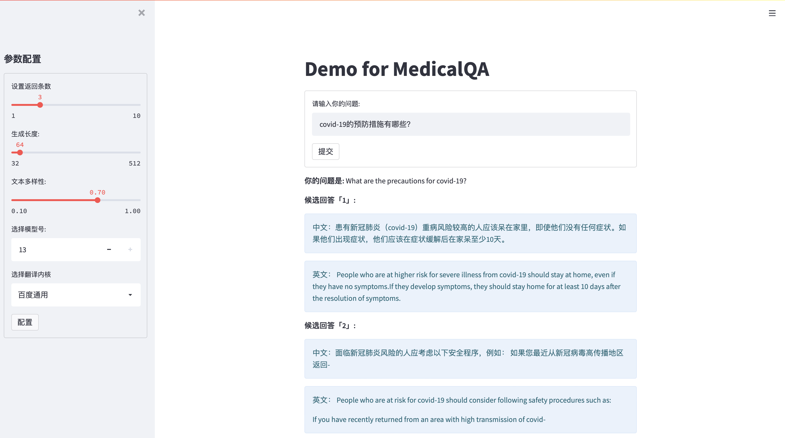

# 「streamlit」快速搭建你的算法demo
在搭建demo之前，首先得做好这些准备工作：
- 模型训练完毕
- 模型的入参确定
- 安装streamlit库，`pip install streamlit` 就可以安装。

streamlit脚本的启动方式是 `streamlit run demo.py`，很简单就启动了一个demo页面，页面会随着脚本代码的改变实时刷新的。所以在没有经验的时候，可以创建一个demo.py的文件，照着下面的教程一步一步添加代码，看页面的展示情况。下面开始上干货，具体细节在代码注释中有说明！

### 第一步 导包
```python 
import streamlit as st
# 其他包更具你的需要导入
```
[streamlit](https://streamlit.io)是一个用于构建机器学习、深度学习、数据可视化demo的python框架。它不需要你有web开发的经验，会写python就可以高效的开发你的demo。

### 第二步 页面导航信息以及布局配置

```python 
st.set_page_config(
     page_title="余元医疗问答", # 页面标签标题
     page_icon=":shark:", # 页面标签图标
     layout="wide", # 页面的布局
     initial_sidebar_state="expanded", # 左侧的sidebar的布局方式
     # 配置菜单按钮的信息
     menu_items={
         'Get Help': 'https://www.extremelycoolapp.com/help',
         'Report a bug': "https://www.extremelycoolapp.com/bug",
         'About': "# This is a header. This is an *extremely* cool app!"
     }
 )
```
这一步可以省略，如果想让app更加个性化，可以添加这些设置。

### 第三步 设置demo标题
```python 
st.title('Demo for MedicalQA') 
```
streamlit的每一个小组件对应于页面都有一个默认的样式展示。

### 第四步 配置demo的参数

```python 
# 此处是用的sidebar，侧边栏作为参数配置模块
st.sidebar.header("参数配置")
# 这里是在sidebar里面创建了表单，每个表单一定有一个标题和提交按钮
sbform = st.sidebar.form("固定参数设置")
# slider是滑动条组建，可以配置数值型参数
n_sample = sbform.slider("设置返回条数",min_value=1,max_value=10,value=3)
text_length = sbform.slider('生成长度:',min_value=32,max_value=512,value=64,step=32)
text_level = sbform.slider('文本多样性:',min_value=0.1,max_value=1.0,value=0.9,step=0.1)
# number_input也可以配置数值型参数
model_id = sbform.number_input('选择模型号:',min_value=0,max_value=13,value=13,step=1)
# selectbox选择组建，只能选择配置的选项
trans = sbform.selectbox('选择翻译内核',['百度通用','医疗生物'])
# 提交表单的配置，这些参数的赋值才生效
sbform.form_submit_button("提交配置")

# 这里是页面中的参数配置，也是demo的主体之一
form = st.form("参数设置")
# 本demo是qa demo，所以要录入用户的文本输入，text_input组建可以实现
input_text = form.text_input('请输入你的问题:',value='',placeholder='例如：糖尿病的症状有哪些？')
form.form_submit_button("提交")
```
以上就把demo的参数基本配置完成了。

### 第五步 模型预测
```python 
# 定义一个前向预测的方法
# @st.cache(suppress_st_warning=True)
def generate_qa(input_text,n_sample,model_id='7',length=64,translator='baidu',level=0.7):
    # 这里我们是把模型用fastapi搭建了一个api服务
    URL = 'http://192.168.190.63:6605/qa'
    data = {"text":input_text,"n_sample":n_sample,"model_id":model_id,"length":length,'translator':translator,'level':level}
    r = requests.get(URL,params=data)
    return r.text
# 模型预测结果
results = generate_qa(input_text,n_sample,model_id=str(model_id),translator=translator,length=text_length,level=text_level)
```
这里说明一下，由于demo展示机器没有GPU，所以模型部署采用的是Fastapi部署在后台的。如果demo展示的机器可以直接部署模型，这里可以直接把模型预测的方法写在这里，不需要另外部署模型，再用api的方式调用。这样做有一个值得注意的地方，因为streamlit的代码每一次运行，都是从头到尾执行一遍，就导致模型可能会重复加载，所以这里需要用到st.cache组建，当内容没有更新的时候，会把这一步的结果缓存，而不会重新执行。保证了效率不会因此而下降。

### 第六步 结果展示
```python 
with st.spinner('老夫正在思考中🤔...'):
    if input_text:
        results = generate_qa(input_text,n_sample,model_id=str(model_id),
                        translator=translator,length=text_length,level=text_level)
        for idx,item in enumerate(eval(results),start=1):
            st.markdown(f"""
            **候选回答「{idx}」:**\n
            """)
            st.info('中文：%s'%item['fy_next_sentence'])
            st.info('英文：%s'%item['next_sentence'])
```
streamlit对不同格式的内容展示，有丰富的组建，对于文本可以用`st.markdown`组建以及`st.text`和`st.write`展示。更多组建和功能可以参考官方文档：https://docs.streamlit.io

至此，一个完整的demo展示就完成了。效果图如下：



完整的代码可以参考：`Fengshenbang-LM/fengshen/examples/FastDemo/YuyuanQA.py`
