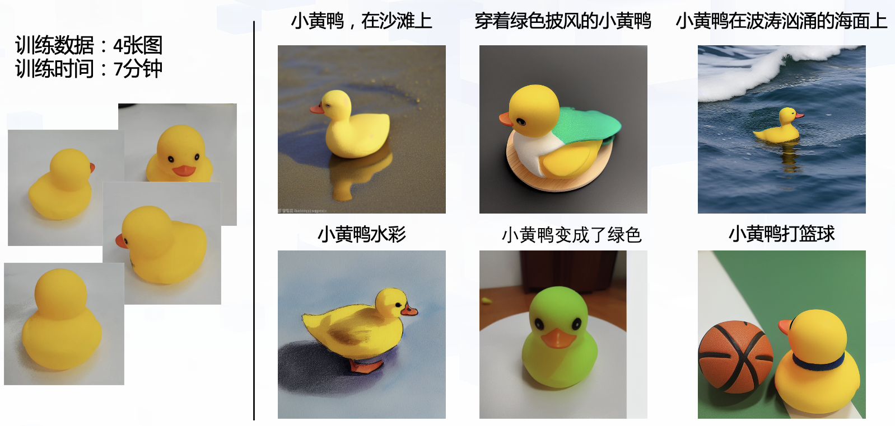

# Taiyi-Stable-Diffusion Dreambooth示例

本示例可以应用于[**IDEA-CCNL/Taiyi-Stable-Diffusion-1B-Chinese-v0.1**](https://huggingface.co/IDEA-CCNL/Taiyi-Stable-Diffusion-1B-Chinese-v0.1)在自建的数据集上用[**DreamBooth**](https://arxiv.org/abs/2208.12242)的方法进行特定对象的训练，同时稍微修改代码也能够兼容大部分Stable-Diffusion结构。本示例仅提供参考，有任何疑问或者有需要协助的都可以提Issue到本项目中，会有专门的同学解答~

## 数据处理

在./train_images_duck下有我们进行展示的一个数据集样例

## 配置要求

[**IDEA-CCNL/Taiyi-Stable-Diffusion-1B-Chinese-v0.1**](https://huggingface.co/IDEA-CCNL/Taiyi-Stable-Diffusion-1B-Chinese-v0.1)十亿级别参数进行dreambooth训练，我们自己测试的配置基础如下，batch_size设定为1～2，另外也可以参考train_with_prior.sh进行fp16和deepspeed加速。

fp32:

- 显存：26G以上
- 内存：64G以上

## 运行脚本

标准版本

sh train.sh

增加先验版本，具体可以参考[论文](https://arxiv.org/abs/2208.12242)

sh train_with_prior.sh

在脚本中也提供了丰富的超参供大家修改，例如batch_size, ckpt_path等等都可以根据自己的需求做更改，其中model_path指向的是huggingface上的模型路径，下载可能比较慢，如果用户已经在本地下载过一份权重，直接将model_path改成本地路径即可。

一些常用的参数我们会放在[封神榜的文档里](https://fengshenbang-doc.readthedocs.io/zh/latest/docs/%E5%B0%81%E7%A5%9E%E6%A1%86%E6%9E%B6/%E5%8F%82%E6%95%B0%E7%AE%A1%E7%90%86.html)

有任何不清楚的地方，不要吝啬你的Issue，直接提过来。

## 一些训练中的Trick

### Deepspeed

在示例中我们默认开始了Deepspeed，通过Deepspeed我们能提高不少训练效率（即使是单卡）。并且得益于Zero Redundancy Optimizer的技术，在多卡的环境我们能显著的减少显存占用，提高batch_size以获得更高的效率，强烈建议有条件的同学开启Deepspeed。train_with_prior.sh在40G的A100上需要开启deepspeed.

### 一点经验

- 图片选取质量更高，图片背景尽量选取纯色

- 对于人脸或者更复杂的可以采用较小的学习率，训练更长的step（800-1200） 

- 目训练的效果不是特别稳定，没有论文中如此惊艳的效果，不过参考[太乙webui的配置](https://github.com/IDEA-CCNL/stable-diffusion-webui/blob/master/README.md)还是能找到很多不错的效果图

- 持续探索中...

### 参考资料
https://arxiv.org/abs/2208.12242

https://dreambooth.github.io/

https://wandb.ai/psuraj/dreambooth/reports/Dreambooth-Training-Analysis--VmlldzoyNzk0NDc3

