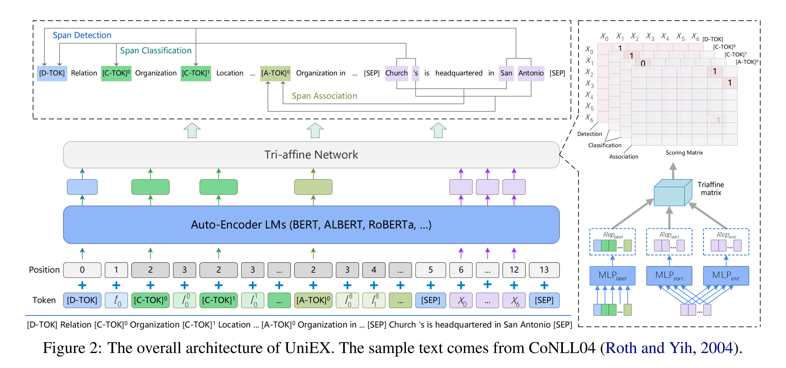
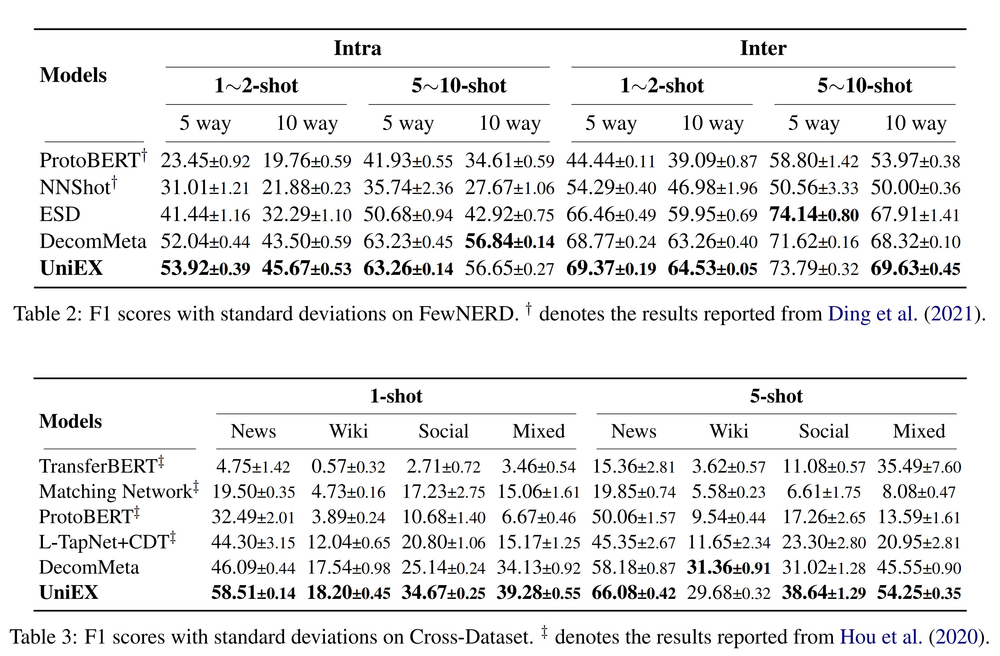

# UniEX

ACL 2023 论文 《[UniEX: An Effective and Efficient Framework for Unified Information Extraction](https://arxiv.org/abs/2305.10306)》源码



### UniEX 的优势
UniEX 可以统一所有信息抽取任务，经过预训练之后可以开箱即用，支持Few-Shot、Zero-Shot等场景。UniEX支持任务如下：
- 实体识别
- 关系抽取
- 事件抽取
- 指代消解
- 抽取式阅读理解


## Requirements

安装 fengshen 框架

```shell
git clone https://github.com/IDEA-CCNL/Fengshenbang-LM.git
cd Fengshenbang-LM
pip install --editable .
```

## Quick Start

你可以参考我们的 [train.sh](./train.sh) 脚本，只需要将处理好的 train、dev、test 即输入模型即可。也可以使用下面代码快速推理。
```python

import argparse
from fengshen.pipelines.information_extraction import UniEXPipelines

total_parser = argparse.ArgumentParser("TASK NAME")
total_parser = UniEXPipelines.pipelines_args(total_parser)
args = total_parser.parse_args()
    
args.pretrained_model_path = 'IDEA-CCNL/Erlangshen-UniEX-RoBERTa-110M-Chinese'

args.threshold_index = 0.5  # 设置位置识别的概率阈值
args.threshold_entity = 0.5  # 设置实体类型的概率阈值
args.threshold_event = 0.5   # 设置事件类型的概率阈值
args.threshold_relation = 0.5 # 设置关系类型的概率阈值

model = UniEXPipelines(args)
train_data = [] 
dev_data = [] 
test_data = [
    {
    "task_type": "实体识别",
    "text": "彭小军认为，国内银行现在走的是台湾的发卡模式，先通过跑马圈地再在圈的地里面选择客户，",
    "entity_list": [],
    "choice": [
        "姓名",
        "地址",
        "组织机构",
        "游戏",
        "景点",
        "书名",
        "职位",
        "公司",
        "政府",
        "电影"
    ],
    "id": 0
}
]

result = model.predict(test_data,cuda=False)
print(result)

```
## Pretrained Model
我们先用baike构建弱监督的抽取数据进行了预训练，然后收集了17份实体识别、6份事件抽取、6份关系抽取、2份指代消解数据集进行精调，最终得到我们的开源模型

| 模型 | 地址   |
|:---------:|:--------------:|
| Erlangshen-UniEX-RoBERTa-110M-Chinese  | [https://huggingface.co/IDEA-CCNL/Erlangshen-UniEX-RoBERTa-110M-Chinese](https://huggingface.co/IDEA-CCNL/Erlangshen-UniEX-RoBERTa-110M-Chinese)       |
| Erlangshen-UniEX-RoBERTa-330M-Chinese  | [https://huggingface.co/IDEA-CCNL/Erlangshen-UniEX-RoBERTa-330M-Chinese](https://huggingface.co/IDEA-CCNL/Erlangshen-UniEX-RoBERTa-330M-Chinese)   |

## Experiments

### 全量数据


### 小样本数据



## Dataset

我们已经定义好了 UniEX 所需的数据格式，每一行是一个jsonline，你只需要将数据转化为下面的数据格式即可：

### 实体识别
```json
{
    "task_type": "实体识别",
    "text": "彭小军认为，国内银行现在走的是台湾的发卡模式，先通过跑马圈地再在圈的地里面选择客户，",
    "entity_list": [
        {
            "entity_text": "彭小军",
            "entity_type": "姓名",
            "entity_index": [
                [
                    0,
                    2
                ]
            ]
        },
        {
            "entity_text": "台湾",
            "entity_type": "地址",
            "entity_index": [
                [
                    15,
                    16
                ]
            ]
        }
    ],
    "choice": [
        "姓名",
        "地址",
        "组织机构",
        "游戏",
        "景点",
        "书名",
        "职位",
        "公司",
        "政府",
        "电影"
    ],
    "id": 0
}

```

### 事件抽取
```json
{
    "task_type": "事件抽取",
    "text": "富国银行收缩农业与能源贷款团队 裁减200多名银行家",
    "entity_list": [],
    "spo_list": [],
    "event_list": [
        {
            "event_type": "裁员",
            "args": [
                {
                    "entity_text": "富国银行",
                    "entity_type": "裁员方",
                    "entity_index": [
                        [
                            0,
                            3
                        ]
                    ]
                },
                {
                    "entity_text": "200多名",
                    "entity_type": "裁员人数",
                    "entity_index": [
                        [
                            18,
                            22
                        ]
                    ]
                }
            ]
        }
    ],
    "choice": [
        {
            "出售/收购": [
                "时间",
                "出售方",
                "交易物",
                "出售价格",
                "收购方"
            ],
            "降价": [
                "时间",
                "降价方",
                "降价物",
                "降价幅度"
            ],
            "胜负": [
                "时间",
                "败者",
                "胜者",
                "赛事名称"
            ],
            "怀孕": [
                "时间",
                "怀孕者"
            ],
            "拘捕": [
                "时间",
                "拘捕者",
                "被拘捕者"
            ],
            "立案": [
                "时间",
                "立案机构",
                "立案对象"
            ],
            "裁员": [
                "时间",
                "裁员方",
                "裁员人数"
            ]
        }
    ],
    "id": 0
}

```

### 关系抽取
```json
{
    "task_type": "关系抽取",
    "text": "厦门博乐德平台拍卖有限公司于2015年9月10日在厦门市市场监督管理局登记成立",
    "entity_list": [],
    "spo_list": [
        {
            "predicate": "成立日期",
            "subject": {
                "entity_text": "厦门博乐德平台拍卖有限公司",
                "entity_type": "机构",
                "entity_index": [
                    [
                        0,
                        12
                    ]
                ]
            },
            "object": {
                "entity_text": "2015年9月10日",
                "entity_type": "时间",
                "entity_index": [
                    [
                        14,
                        23
                    ]
                ]
            }
        }
    ],
    "choice": [
        [
            "机构",
            "成立日期",
            "时间"
        ],
        [
            "机构",
            "占地面积",
            "数字"
        ],
        [
            "影视作品",
            "制片人",
            "人物"
        ],
        [
            "行政区",
            "邮政编码",
            "具体邮政编码是"
        ],
        [
            "歌曲",
            "作词",
            "人物"
        ],
        [
            "企业",
            "总部地点",
            "地点"
        ],
        [
            "企业",
            "董事长",
            "人物"
        ],
        [
            "影视作品",
            "编剧",
            "人物"
        ]
    ],
    "id": 0
}

```

### 指代消解
```json
{
	"task_type": "指代消解",
	"text": "气功师的目光在黛二身上停留了一瞬间，然后说：“你经常头疼是不是？如果你愿意，我可以帮助你。”黛二抬头望望他的眼睛，它散发出一种征服者般无可抵御的温情，那神情就是一声无声的军令。",
	"entity_list": [],
	"spo_list": [{
		"predicate": "指代",
		"subject": {
			"entity_text": "它",
			"entity_type": "代词",
			"entity_index": [
				[57, 57]
			]
		},
		"object": {
			"entity_text": "眼睛",
			"entity_type": "名词",
			"entity_index": [
				[54, 55]
			]
		}
	}],
	"choice": [
		["代词", "指代", "名词"]
	],
	"id": 0
}
```

### 抽取式阅读理解
```json
{
	"task_type": "抽取式阅读理解",
	"text": "2008年夏季奥林匹克运动会马术比赛－团体三项赛于2008年8月9日至8月12日在香港的香港奥运马术场举行，团体三项赛是本届马术射击比赛最早举行的小项，亦是开幕式后首个进行的比赛小项，比赛共有来自11个国家或地区的53名运动员参与。最终8月12日举行的决赛中，2006年世界赛冠军德国队以166.10的总罚分夺金，澳洲队以171.2的总罚分获得亚军，英国队则以185.70的总罚分获得一枚铜牌。前三名在是项比赛表现非常稳定，其中德国队分别在场地障碍赛及越野赛获得第一名，前三名的成绩比较接近，剩下队伍与前三名的分数差距比较大。德国队是继1988年汉城奥运会以西德队身份夺冠后，第二次获得马术团体三项赛金牌。团体三项赛是由盛装舞步赛、越野赛及场地障碍赛组成，而团体赛和个人赛同时进行，另设一轮场地障碍赛作为决赛，以确定个人赛名次。参赛骑手和马匹组合完成三项赛后，计算所属国家累积最佳成绩（最少罚分）的3名运动员，罚分最少的国家则成绩冠军，如果出现有国家出现同分，则计算各队最佳成绩的第三名总排名，排名最高者为冠军。三项赛每个参赛队由3至5名骑手和马匹组合组成，不可申报备用马匹。场地障碍赛每个参赛队由3或4名骑手和马匹组合组成，每队允许申报一匹备用马，总计约15匹备用马匹。盛装舞步每个参赛队由3名骑手和马匹组合组成，每队允许申报一匹备用马，总计约10匹备用马匹。! 比赛日! 日期! 时间! 阶段",
	"entity_list": [{
		"entity_text": "德国",
		"entity_type": "决赛中哪个国家赢得了金牌？",
		"entity_index": [
			[140, 141]
		]
	}],
	"choice": ["决赛中哪个国家赢得了金牌？"],
	"id": 0
}
```


## Citation
如果你觉得本仓库帮助到了你，你可以使用下面方式引用我们的工作

```text
@inproceedings{UniEX,
  author={Ping Yang and 
          Junyu Lu and 
          Ruyi Gan and 
          Junjie Wang and 
          Yuxiang Zhang and 
          Jiaxing Zhang and 
          Pingjian Zhang},
  title={UniEX: An Effective and Efficient Framework for Unified Information Extraction via a Span-extractive Perspective},
  year={2023}
}
```

## License

[Apache License 2.0](https://github.com/IDEA-CCNL/Fengshenbang-LM/blob/main/LICENSE)

