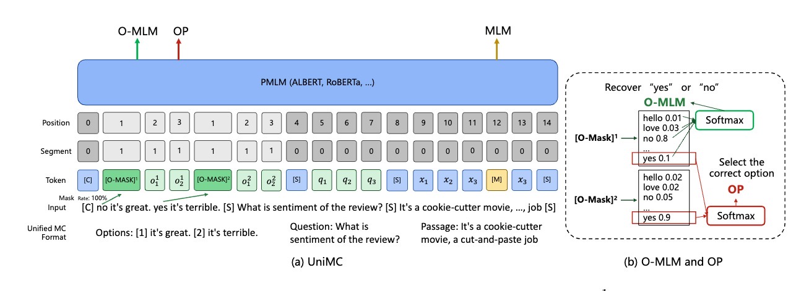

[**中文**](./README.md) | [**English**](./README_en.md)
# UniMC

EMNLP 2022 论文 《[Zero-Shot Learners for Natural Language Understanding via a Unified Multiple Choice Perspective]()》源码



## Update
- [2022-10-16] Release preprint in arXiv.
- [2022-10-14] Release code in GitHub.

## Requirements

安装 fengshen 框架

```shell
git clone https://github.com/IDEA-CCNL/Fengshenbang-LM.git
cd Fengshenbang-LM
pip install --editable .
```

## Quick Start

你可以参考我们的 [example.py](./example.py) 脚本，只需要将处理好的 train、dev、test 即输入模型即可。
```python
import argparse
from fengshen.pipelines.multiplechoice import UniMCPiplines

total_parser = argparse.ArgumentParser("TASK NAME")
total_parser = UniMCPiplines.piplines_args(total_parser)
args = total_parser.parse_args()
    
pretrained_model_path = 'IDEA-CCNL/Erlangshen-RoBERTa-110M-UniMC-Chinese'
args.learning_rate=2e-5
args.max_length=512
args.max_epochs=3
args.batchsize=8
args.default_root_dir='./'
model = UniMCPiplines(args,model_path=pretrained_model_path)

train_data = [] 
dev_data = [] 
test_data = [{
	"texta": "就是废物，充电不进害得老子把主板烧了，客服不耐烦",
	"textb": "",
	"question": "",
	"choice": ["这是一条差评", "这是一条好评"],
	"answer": "这是一条差评",
	"label": 0,
	"id": 31
}]

if args.train:
	model.fit(train_data, dev_data)
result = model.predict(test_data)
```
## Pretrained Model
对于英文模型，我们使用14份 multiplechoice 数据集进行了预训练。在中文模型中，我们已经收集了48份数据集对模型进行预训练，我们已经将预训练模型开源到 HuggingFace 社区当中。

| 模型 | 地址   |
|:---------:|:--------------:|
| Erlangshen-Albert-235M-UniMC-English  | [https://huggingface.co/IDEA-CCNL/Erlangshen-Albert-235M-UniMC-English](https://huggingface.co/IDEA-CCNL/Erlangshen-Albert-235M-UniMC-English)   |
| Erlangshen-RoBERTa-110M-UniMC-Chinese  | [https://huggingface.co/IDEA-CCNL/Erlangshen-RoBERTa-110M-UniMC-Chinese](https://huggingface.co/IDEA-CCNL/Erlangshen-RoBERTa-110M-UniMC-Chinese)       |
| Erlangshen-RoBERTa-330M-UniMC-Chinese  | [https://huggingface.co/IDEA-CCNL/Erlangshen-RoBERTa-330M-UniMC-Chinese](https://huggingface.co/IDEA-CCNL/Erlangshen-RoBERTa-330M-UniMC-Chinese)   |
| Erlangshen-MegatronBERT-1.3B-UniMC-Chinese  | [https://huggingface.co/IDEA-CCNL/Erlangshen-MegatronBERT-1.3B-UniMC-Chinese](https://huggingface.co/IDEA-CCNL/Erlangshen-MegatronBERT-1.3B-UniMC-Chinese)       |

## Experiments


### English
为了测评 UniMC 的性能，在英文中，我们使用 14份 multiple-choice 数据集（具体数据参考原论文）来对模型进行预训练，使其具备做选择题的能力，

**Zero-shot**
| Model   | T0 11B | GLaM 60B | FLAN 137B | PaLM 540B | UniMC 235M |
|---------|--------|----------|-----------|-----------|------------|
| ANLI R1 | 43.6   | 40.9     | 47.7      | 48.4      | **52.0**         |
| ANLI R2 | 38.7   | 38.2     | 43.9      | 44.2      | **44.4**       |
| ANLI R3 | 41.3   | 40.9     | 47.0        | 45.7      | **47.8**       |
| CB      | 70.1   | 33.9     | 64.1      | 51.8      | **75.7**       |
### Chinese
为了测评 UniMC 在中文场景下的性能我们使用 13份 有监督数据集来对模型进行预训练,预训练数据如下：
| Task type   | Task | # of option | Data size |
|---------|--------|----------|-----------|
| Multiple-choice | c3   | 4     | 11.8k      |
| Multiple-choice | ClozeT   | 2     | 0.7k      | 
| Multiple-choice | CMRC2019   | n     | 11.4k        |
| Multiple-choice      | GCRC   | 4     | 7.8k      |
| Classification | DuEE-Fin   | 12     | 4.3k      |
| Classification | DuEE1.0   | 65     | 10.3k      | 
| Classification | Fudan   | 20     | 19.6k        |
| Classification | THUNEWS   | 10     | 180k      |
| NLI | CMNLI   | 3     | 39k      |
| NLI | SNLI   | 3     | 545.8k      | 
| Paraphrace | AFQMC   | 2     | 34.3k        |
| Paraphrace | PAWS-X   | 2     | 49k      |
| Paraphrace | STS-B   | 2     | 80k      |

我们使用中文领域常用的benchmark来测试UniMC的性能，具体是FewCLUE的9个任务

**Few-shot**的结果如下表所示
| Model      | eprstmt    | csldcp   | tnews     | iflytek  | ocnli     | bustm     | chid      | csl      | wsc       | Avg       |
|------------|------------|----------|-----------|----------|-----------|-----------|-----------|----------|-----------|-----------|
| Finetuning | 65.4       | 35.5     | 49        | 32.8     | 33        | 60.7      | 14.9      | 50       | 55.6      | 44.1      |
| PET        | 86.7       | 51.7     | 54.5      | 46       | 44        | 56        | 61.2      | 59.4     | 57.5      | 57.44     |
| LM-BFF     | 85.6       | 54.4     | 53        | 47.1     | 41.6      | 57.6      | 61.2      | 51.7     | 54.7      | 56.32     |
| P-tuning   | 88.3       | 56       | 54.2      | **57.6** | 41.9      | 60.9      | 59.3      | **62.9** | 58.1      | 59.91     |
| EFL        | 84.9       | 45       | 52.1      | 42.7     | 66.2      | 71.8      | 30.9      | 56.6     | 53        | 55.91     |
| [UniMC-110M](https://huggingface.co/IDEA-CCNL/Erlangshen-RoBERTa-110M-UniMC-Chinese) | 88.64      | 54.08    | 54.32     | 48.6     | 66.55     | 73.76     | 67.71     | 52.54    | 59.92     | 62.86     |
| [UniMC-330M](https://huggingface.co/IDEA-CCNL/Erlangshen-RoBERTa-330M-UniMC-Chinese) | 89.53      | 57.3     | 54.25     | 50       | 70.59     | 77.49     | 78.09     | 55.73    | 65.16     | 66.46     |
| [UniMC-1.3B](https://huggingface.co/IDEA-CCNL/Erlangshen-MegatronBERT-1.3B-UniMC-Chinese) | **89.278** | **60.9** | **57.46** | 52.89    | **76.33** | **80.37** | **90.33** | 61.73    | **79.15** | **72.05** |

**Zero-shot**的结果如下表所示

| Model         | eprstmt   | csldcp    | tnews     | iflytek   | ocnli     | bustm    | chid     | csl      | wsc       | Avg       |
|---------------|-----------|-----------|-----------|-----------|-----------|----------|----------|----------|-----------|-----------|
| GPT-zero      | 57.5      | 26.2      | 37        | 19        | 34.4      | 50       | 65.6     | 50.1     | 50.3      | 43.4      |
| PET-zero      | 85.2      | 12.6      | 26.1      | 26.6      | 40.3      | 50.6     | 57.6     | 52.2     | 54.7      | 45.1      |
| NSP-BERT      | 86.9      | 47.6      | 51        | 41.6      | 37.4      | 63.4     | 52       | **64.4** | 59.4      | 55.96     |
| ZeroPrompt    | -         | -         | -         | 16.14     | 46.16     | -        | -        | -        | 47.98     | -         |
|  Yuan1.0-13B  | 88.13     | 38.99     | 57.47     | 38.82     | 48.13     | 59.38    | 86.14    | 50       | 38.99     | 56.22     |
| ERNIE3.0-240B | 88.75     | **50.97** | **57.83** | **40.42** | 53.57     | 64.38    | 87.13    | 56.25    | 53.46     | 61.41     |
| UniMC-110M    | 86.16     | 31.26     | 46.61     | 26.54     | 66.91     | 73.34    | 66.68    | 50.09    | 53.66     | 55.7      |
| UniMC-330M    | 87.5      | 30.4      | 47.6      | 31.5      | 69.9      | 75.9     | 78.17    | 49.5     | 60.55     | 59.01     |
| [UniMC-1.3B](https://huggingface.co/IDEA-CCNL/Erlangshen-MegatronBERT-1.3B-UniMC-Chinese)     | **88.79** | 42.06     | 55.21     | 33.93     | **75.57** | **79.5** | **89.4** | 50.25    | **66.67** | **64.53** |


## Dataset

我们已经定义好了 UniMC 所需的数据格式，你只需要将数据转化为下面的数据格式即可：

### 文本分类
```json
{
    "texta": "街头偶遇2018款长安CS35，颜值美炸！或售6万起，还买宝骏510？",   
    "textb": "", 
    "question": "下面新闻属于哪一个类别？",   
    "choice": [
        "房产", 
        "汽车", 
        "教育",
        "军事"
        ], 
    "answer": "汽车", 
    "label": 1, 
    "id": 7759
}

```

### 情感分析
```json
{
	"texta": "就是废物，充电不进害得老子把主板烧了，客服不耐烦",
	"textb": "",
	"question": "",
	"choice": ["这是一条差评", "这是一条好评"],
	"answer": "这是一条差评",
	"label": 0,
	"id": 31
}

```

### 语义匹配
```json
{
	"texta": "不要借了我是试试看能否操作的",
	"textb": "",
	"question": "",
	"choice": ["不能理解为：借款审核期间能否取消借款", "可以理解为：借款审核期间能否取消借款"],
	"answer": "不能理解为：借款审核期间能否取消借款",
	"label": 0,
	"id": 0
}

```

### 自然语言推理
```json
{
	"texta": "身上裹一件工厂发的棉大衣,手插在袖筒里",
	"textb": "",
	"question": "",
	"choice": ["不能推断出：身上至少一件衣服", "很难推断出：身上至少一件衣服", "可以推断出：身上至少一件衣服"],
	"answer": "可以推断出：身上至少一件衣服",
	"label": 2,
	"id": 0
}

```


## Citation
如果你觉得本仓库帮助到了你，你可以使用下面方式引用我们的工作

```text
@article{DBLP:journals/corr/abs-2209-02970,
  author    = {Junjie Wang and
               Yuxiang Zhang and
               Lin Zhang and
               Ping Yang and
               Xinyu Gao and
               Ziwei Wu and
               Xiaoqun Dong and
               Junqing He and
               Jianheng Zhuo and
               Qi Yang and
               Yongfeng Huang and
               Xiayu Li and
               Yanghan Wu and
               Junyu Lu and
               Xinyu Zhu and
               Weifeng Chen and
               Ting Han and
               Kunhao Pan and
               Rui Wang and
               Hao Wang and
               Xiaojun Wu and
               Zhongshen Zeng and
               Chongpei Chen and
               Ruyi Gan and
               Jiaxing Zhang},
  title     = {Fengshenbang 1.0: Being the Foundation of Chinese Cognitive Intelligence},
  journal   = {CoRR},
  volume    = {abs/2209.02970},
  year      = {2022}
}
```

## License

[Apache License 2.0](https://github.com/IDEA-CCNL/Fengshenbang-LM/blob/main/LICENSE)

